```python
from pathlib import Path

import cartopy.crs as ccrs
import iris
import matplotlib.pyplot as plt
import matplotlib.ticker as mticker
from matplotlib.colors import LogNorm
import matplotlib.patches as patches
import numpy as np
import pandas as pd
import seaborn as sns
import shapely
from scipy.stats import linregress
import xarray as xr

from mcs_prime import mcs_prime_config_util as cu
```

    /home/users/mmuetz/projects/mcs_prime/mcs_prime/mcs_prime_config_util.py:69: UserWarning: Warning: path missing era5dir: /does/not/exist
      warnings.warn(f"Warning: path missing {k}: {path}")


```python
datadir = cu.PATHS['datadir']
simdir = datadir / 'UM_sims'
OUTDIR = cu.PATHS['outdir']
```


```python
suites = {
    'u-dg040': 'ctrl',
    'u-dg041': 'PRIME-MCSP',
    'u-dg042': 'PRIME-stochMCSP',
}
```


```python


def get_daily_mean_precip_flux(nc_path):
    df = xr.open_dataset(nc_path)
    tindex = xr.CFTimeIndex(df.precipitation_flux.time_1.values)
    # precipitation_flux is included twice in this stream with different time avgs.
    # Extract the daily mean values.
    tfilter = (tindex.hour == 12) & (tindex.minute == 0)
    pflux = df.precipitation_flux.isel(dim0=tfilter)
    return pflux
    
def load_suite_data(suite):
    print(suite)
    nc_paths = sorted((simdir / suite).glob(f'{suite[2:]}a.pd*.nc'))
    print(nc_paths)
    pflux = xr.concat([get_daily_mean_precip_flux(p) for p in nc_paths], dim='dim0')
    return pflux

def load_suite_data2(suite):
    precip_path = OUTDIR / f'um_sims_analysis/dev/extract_precip/{suite}_extracted_precip.nc'
    return xr.open_dataarray(precip_path)
    
```


```python
suite_data_daily = {
    suite: load_suite_data2(suite)
    for suite in suites.keys()
}
suite_data = {
    suite: load_suite_data2(suite).mean(dim='dim0')
    for suite in suites.keys()
}
```


```python
def plot_suites(suites, suite_data):
    fig, axes = plt.subplots(2, 3, subplot_kw={'projection': ccrs.PlateCarree()}, layout='constrained')
    fig.set_size_inches((24, 8))
    cubehelix = sns.color_palette('cubehelix_r', as_cmap=True)
    vlag = sns.color_palette('vlag_r', as_cmap=True)
    axes[1, 0].axis('off')
    for suite, ax in zip(suites.keys(), axes[0]):
        pflux = suite_data[suite]
        im = (pflux * 3600 * 24).plot(ax=ax, cmap='Blues', levels=np.linspace(0, 12, 13), add_colorbar=False)
        ax.set_title(suites[suite])
        if suites[suite] == 'ctrl':
            ctrl_pflux = pflux
        ax.coastlines()
    plt.colorbar(im, ax=axes[0], label='precip. (mm day$^{-1}$)')
    for suite, ax in zip(suites.keys(), axes[1]):
        if suites[suite] == 'ctrl':
            continue
        pflux = suite_data[suite]
        im = (pflux * 3600 * 24 - ctrl_pflux * 3600 * 24).plot(ax=ax, cmap=vlag, levels=np.linspace(-3, 3, 13), add_colorbar=False)
        ax.set_title(f'{suites[suite]} - ctrl')
        ax.coastlines()
    plt.colorbar(im, ax=axes[1], label='$\Delta$ precip. (mm day$^{-1}$)')

    for ax in axes[0, 1:]:
        gl = ax.gridlines(crs=ccrs.PlateCarree(), draw_labels=False, linewidth=1, color='gray')
        gl.xlocator = mticker.FixedLocator(np.arange(-180, 181, 45))
        gl.ylocator = mticker.FixedLocator(np.arange(-90, 90, 45))
    for idx in [(0, 0), (1, 1), (1, 2)]:
        ax = axes[idx]
        gl = ax.gridlines(crs=ccrs.PlateCarree(), draw_labels=True, linewidth=1, color='gray')
        gl.xlocator = mticker.FixedLocator(np.arange(-180, 181, 45))
        gl.ylocator = mticker.FixedLocator(np.arange(-90, 90, 45))
        gl.top_labels = False
        gl.right_labels = False
        if idx == (1, 2):
            gl.left_labels = False
            

plot_suites(suites, suite_data)
```


    
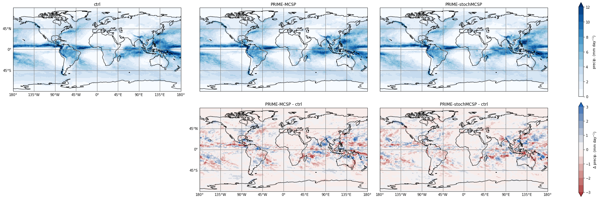
    


```python
def plot_suites_diff_only(suites, suite_data):
    fig, axes = plt.subplots(1, 2, subplot_kw={'projection': ccrs.PlateCarree()}, layout='constrained')
    fig.set_size_inches((24, 8))
    vlag = sns.color_palette('vlag_r', as_cmap=True)
    ctrl_pflux = suite_data['u-dg040']
    for suite, ax in zip(['u-dg041', 'u-dg042'], axes):
        if suites[suite] == 'ctrl':
            continue
        pflux = suite_data[suite]
        im = (pflux * 3600 * 24 - ctrl_pflux * 3600 * 24).plot(ax=ax, cmap=vlag, levels=np.linspace(-3, 3, 13), add_colorbar=False)
        ax.set_title(f'{suites[suite]} - ctrl')
        ax.coastlines()
    plt.colorbar(im, ax=axes[1], label='$\Delta$ precip. (mm day$^{-1}$)')

    for ax in axes[1:]:
        gl = ax.gridlines(crs=ccrs.PlateCarree(), draw_labels=True, linewidth=1, color='gray')
        gl.xlocator = mticker.FixedLocator(np.arange(-180, 181, 45))
        gl.ylocator = mticker.FixedLocator(np.arange(-90, 90, 45))
        gl.top_labels = False
        gl.right_labels = False
        gl.left_labels = False
    for ax in axes[0:]:
        gl = ax.gridlines(crs=ccrs.PlateCarree(), draw_labels=True, linewidth=1, color='gray')
        gl.xlocator = mticker.FixedLocator(np.arange(-180, 181, 45))
        gl.ylocator = mticker.FixedLocator(np.arange(-90, 90, 45))
        gl.top_labels = False
        gl.right_labels = False         

plot_suites_diff_only(suites, suite_data)
```


    
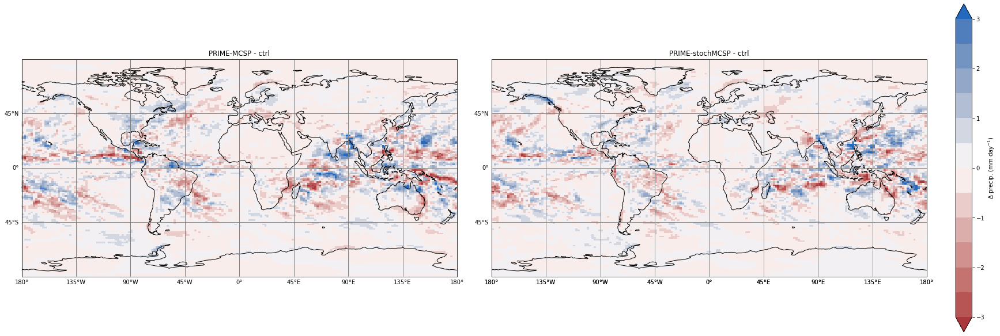
    


```python
def plot_corr(suites, suite_data):
    ctrl_pflux = suite_data['u-dg040']
    fig, axes = plt.subplots(1, 2)
    fig.set_size_inches(20, 10)
    for ax, suite in zip(axes, ['u-dg041', 'u-dg042']):
        ax.set_title(f'ctrl vs {suites[suite]}')
        pflux = suite_data[suite]
        lr = linregress(ctrl_pflux.values.flatten() * 3600 * 24, pflux.values.flatten() * 3600 * 24)
        # plt.scatter(ctrl_pflux.values.flatten() * 3600 * 24, pflux.values.flatten() * 3600 * 24)
        ax.hist2d(ctrl_pflux.values.flatten() * 3600 * 24, pflux.values.flatten() * 3600 * 24, bins=(100, 100), norm=LogNorm())
        ax.plot([0, 20], [0, 20], 'k--', label='y=x')
        ax.set_aspect('equal')
        ax.set_xlim((0, 20))
        ax.set_ylim((0, 20))
        x = np.array([0, 20])
        y = lr.slope * x + lr.intercept
        ax.plot(x, y, 'b--', label=f'slope={lr.slope:.2f}, intercept={lr.intercept:.2f}\np={lr.pvalue}, r$^2$={lr.rvalue**2:.3f}')
        ax.legend()
        ax.set_xlabel('ctrl precip. (mm day$^{-1}$)')
        ax.set_ylabel(suites[suite] + ' precip. (mm day$^{-1}$)')
        
plot_corr(suites, suite_data)
```


    
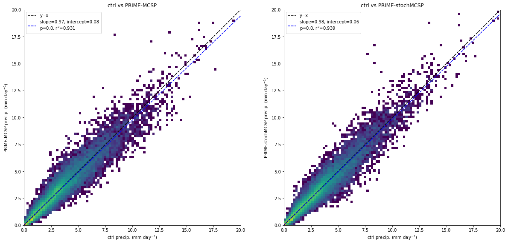
    


```python
cmap1_colours = ['#2730d7', '#598dfc', '#8befd9', '#60cf91', '#1a9850', '#91cf60', '#d9ef8b', '#fee08b', '#fc8d59', '#d73027']
cmap1 = mpl.colors.ListedColormap(cmap1_colours)
cmap1.set_extremes(over='#960064', under='#640096')
# norm = mpl.colors.BoundaryNorm([0.0, 1.0, 2.0, 3.0, 4.0, 5.0, 6.0, 7.0, 8.0, 9.0, 10.0], cmap.N)

```


```python
cmap2_colours = ['#175eb8', '#3da1f0', '#6fc7fd', '#a7f1ff', '#ddfdff', '#fff5c0', '#ffc746', '#ff8800', '#ff3600', '#d20a00']
cmap2 = mpl.colors.ListedColormap(cmap2_colours)
cmap2.set_extremes(over='#a50000', under='#0a3278')
# norm = mpl.colors.BoundaryNorm([-5.0, -4.0, -3.0, -2.0, -1.0, 0.0, 1.0, 2.0, 3.0, 4.0, 5.0], cmap2.N)
```


```python
def plot_suites2(suites, suite_data):
    fig, axes = plt.subplots(2, 3, subplot_kw={'projection': ccrs.PlateCarree()}, layout='constrained')
    fig.set_size_inches((24, 8))
    cubehelix = sns.color_palette('cubehelix_r', as_cmap=True)
    vlag = sns.color_palette('vlag_r', as_cmap=True)
    axes[1, 0].axis('off')
    for suite, ax in zip(suites.keys(), axes[0]):
        pflux = suite_data[suite]
        im = (pflux * 3600 * 24).plot(ax=ax, cmap=cmap1, levels=np.linspace(0, 10, 11), add_colorbar=False)
        ax.set_title(suites[suite])
        if suites[suite] == 'ctrl':
            ctrl_pflux = pflux
        ax.coastlines()
    plt.colorbar(im, ax=axes[0], label='precip. (mm day$^{-1}$)')
    for suite, ax in zip(suites.keys(), axes[1]):
        if suites[suite] == 'ctrl':
            continue
        pflux = suite_data[suite]
        im = (pflux * 3600 * 24 - ctrl_pflux * 3600 * 24).plot(ax=ax, cmap=cmap2, levels=np.linspace(-3, 3, 11), add_colorbar=False)
        ax.set_title(f'{suites[suite]} - ctrl')
        ax.coastlines()
    plt.colorbar(im, ax=axes[1], label='$\Delta$ precip. (mm day$^{-1}$)')

    for ax in axes[0, 1:]:
        gl = ax.gridlines(crs=ccrs.PlateCarree(), draw_labels=False, linewidth=1, color='gray')
        gl.xlocator = mticker.FixedLocator(np.arange(-180, 181, 45))
        gl.ylocator = mticker.FixedLocator(np.arange(-90, 90, 45))
    for idx in [(0, 0), (1, 1), (1, 2)]:
        ax = axes[idx]
        gl = ax.gridlines(crs=ccrs.PlateCarree(), draw_labels=True, linewidth=1, color='gray')
        gl.xlocator = mticker.FixedLocator(np.arange(-180, 181, 45))
        gl.ylocator = mticker.FixedLocator(np.arange(-90, 90, 45))
        gl.top_labels = False
        gl.right_labels = False
        if idx == (1, 2):
            gl.left_labels = False
            

plot_suites2(suites, suite_data)
```


    
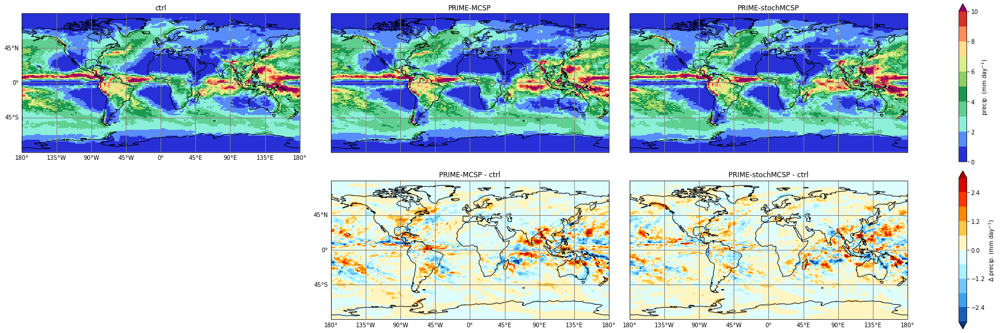
    


```python
pflux_ctrl = suite_data['u-dg040']

for suite in suites.keys():
    pflux = suite_data[suite]
    print(np.abs(np.percentile(pflux.values.flatten() * 3600 * 24, 99)).max())
    print(np.abs(np.percentile((pflux.values.flatten() - pflux_ctrl.values.flatten()) * 3600 * 24, [1, 99])).max())
    
```

    10.577704410552961
    0.0
    10.223913993835446
    1.8978051137924117
    10.608353271484361
    1.799762959480285


```python
def plot_suites2_percentiles(suites, suite_data):
    fig, axes = plt.subplots(2, 3, subplot_kw={'projection': ccrs.PlateCarree()}, layout='constrained')
    fig.set_size_inches((24, 8))
    cubehelix = sns.color_palette('cubehelix_r', as_cmap=True)
    vlag = sns.color_palette('vlag_r', as_cmap=True)
    axes[1, 0].axis('off')
    for suite, ax in zip(suites.keys(), axes[0]):
        pflux = suite_data[suite]
        im = (pflux * 3600 * 24).plot(ax=ax, cmap=cmap1, levels=np.linspace(0, 10.608353271484361, 11), add_colorbar=False)
        ax.set_title(suites[suite])
        if suites[suite] == 'ctrl':
            ctrl_pflux = pflux
        ax.coastlines()
    plt.colorbar(im, ax=axes[0], label='precip. (mm day$^{-1}$)')
    for suite, ax in zip(suites.keys(), axes[1]):
        if suites[suite] == 'ctrl':
            continue
        pflux = suite_data[suite]
        im = (pflux * 3600 * 24 - ctrl_pflux * 3600 * 24).plot(ax=ax, cmap=cmap2, levels=np.linspace(-1.9, 1.9, 11), add_colorbar=False)
        ax.set_title(f'{suites[suite]} - ctrl')
        ax.coastlines()
    plt.colorbar(im, ax=axes[1], label='$\Delta$ precip. (mm day$^{-1}$)')

    for ax in axes[0, 1:]:
        gl = ax.gridlines(crs=ccrs.PlateCarree(), draw_labels=False, linewidth=1, color='gray')
        gl.xlocator = mticker.FixedLocator(np.arange(-180, 181, 45))
        gl.ylocator = mticker.FixedLocator(np.arange(-90, 90, 45))
    for idx in [(0, 0), (1, 1), (1, 2)]:
        ax = axes[idx]
        gl = ax.gridlines(crs=ccrs.PlateCarree(), draw_labels=True, linewidth=1, color='gray')
        gl.xlocator = mticker.FixedLocator(np.arange(-180, 181, 45))
        gl.ylocator = mticker.FixedLocator(np.arange(-90, 90, 45))
        gl.top_labels = False
        gl.right_labels = False
        if idx == (1, 2):
            gl.left_labels = False
            

plot_suites2_percentiles(suites, suite_data)
```


    
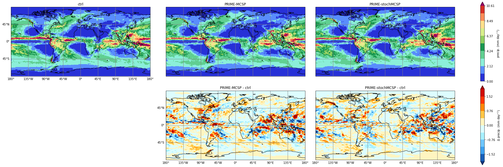
    


```python
def plot_suites3(suites, suite_data):
    fig, axes = plt.subplots(2, 3, subplot_kw={'projection': ccrs.PlateCarree()}, layout='constrained')
    fig.set_size_inches((24, 8))
    axes[1, 0].axis('off')
    for suite, ax in zip(suites.keys(), axes[0]):
        pflux = suite_data[suite]
        # im = (pflux * 3600 * 24).plot(ax=ax, cmap=cmap, levels=np.linspace(0, 10, 11), add_colorbar=False)
        im = ax.contourf(pflux.longitude, pflux.latitude, pflux * 3600 * 24, cmap=cmap1, levels=np.linspace(0, 11, 12), extend='max')
        ax.set_title(suites[suite])
        if suites[suite] == 'ctrl':
            ctrl_pflux = pflux
        ax.coastlines()
    plt.colorbar(im, ax=axes[0], label='precip. (mm day$^{-1}$)')
    for suite, ax in zip(suites.keys(), axes[1]):
        if suites[suite] == 'ctrl':
            continue
        pflux = suite_data[suite]
        # im = (pflux * 3600 * 24 - ctrl_pflux * 3600 * 24).plot(ax=ax, cmap=cmap2, levels=np.linspace(-3, 3, 11), add_colorbar=False)
        im = ax.contourf(pflux.longitude, pflux.latitude, pflux * 3600 * 24 - ctrl_pflux * 3600 * 24, cmap=cmap2, levels=np.linspace(-3, 3, 11), extend='both')
        ax.set_title(f'{suites[suite]} - ctrl')
        ax.coastlines()
    plt.colorbar(im, ax=axes[1], label='$\Delta$ precip. (mm day$^{-1}$)')

    for ax in axes[0, 1:]:
        gl = ax.gridlines(crs=ccrs.PlateCarree(), draw_labels=False, linewidth=1, color='gray')
        gl.xlocator = mticker.FixedLocator(np.arange(-180, 181, 45))
        gl.ylocator = mticker.FixedLocator(np.arange(-90, 90, 45))
    for idx in [(0, 0), (1, 1), (1, 2)]:
        ax = axes[idx]
        gl = ax.gridlines(crs=ccrs.PlateCarree(), draw_labels=True, linewidth=1, color='gray')
        gl.xlocator = mticker.FixedLocator(np.arange(-180, 181, 45))
        gl.ylocator = mticker.FixedLocator(np.arange(-90, 90, 45))
        gl.top_labels = False
        gl.right_labels = False
        if idx == (1, 2):
            gl.left_labels = False
            

plot_suites3(suites, suite_data)
```


    
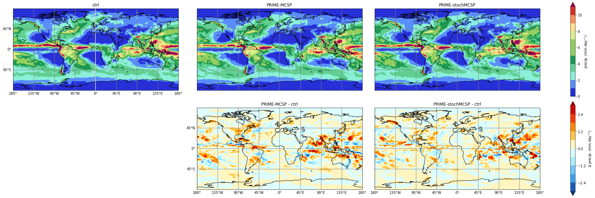
    


```python
boxes = {
    'indian_ocean': (50, 100, -10, 10),
    'india': (70, 90, 10, 30),
    'west_pacific': (110, 170, 5, 30),
}
```


```python
fig, ax = plt.subplots(1, 1, subplot_kw={'projection': ccrs.PlateCarree()}, layout='constrained')
fig.set_size_inches((24, 8))
ax.coastlines()

for bname, bcoords in boxes.items():
    minx, maxx, miny, maxy = bcoords
    bpoints = ((minx, miny), (minx, maxy), (maxx, maxy), (maxx, miny))
    box = shapely.geometry.LinearRing(bpoints)
    # Add geometry for each nested grid size.
    ax.add_geometries([box], crs=ccrs.PlateCarree(), edgecolor='magenta', facecolor='none', lw=3)

for bname, bcoords in boxes.items():
    pflux = suite_data['u-dg040']
    minx, maxx, miny, maxy = bcoords
    pflux_box = pflux.sel(longitude=slice(minx, maxx), latitude=slice(miny, maxy))
    pflux_box.plot(ax=ax, add_colorbar=False)
ax.set_extent((-180, 180, -90, 90))

```


    
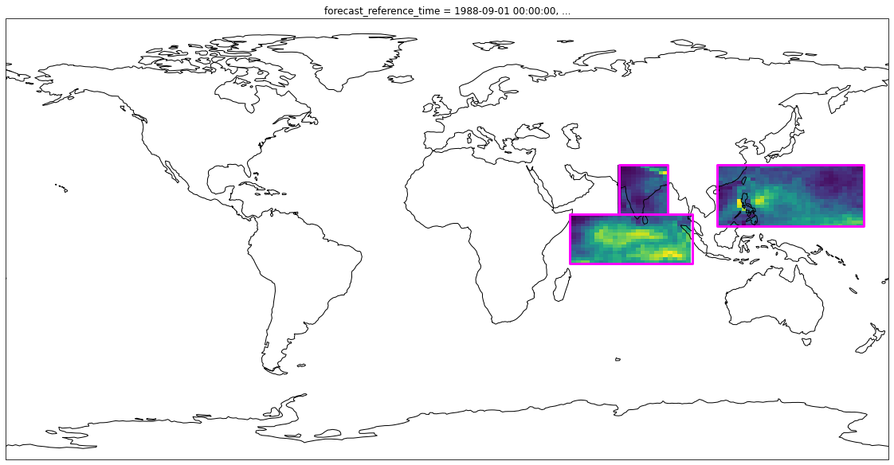
    


```python
monthly_data = {}
# Time index is messed up due to files names of sep, oct...
pflux_daily = suite_data_daily['u-dg040']

tindex = xr.CFTimeIndex(pflux_daily.time_1.values)

for suite in suites:
    pflux_daily = suite_data_daily[suite]
    monthly_data[suite] = {}
    for bname in boxes.keys():
        monthly_data[suite][bname] = []
    for m in range(12):
        pmonth = pflux_daily.isel(dim0=tindex.month == m + 1).mean(dim='dim0')
        #print(pmonth)
        for bname, bcoords in boxes.items():
            minx, maxx, miny, maxy = bcoords
            pmonth_box = pmonth.sel(longitude=slice(minx, maxx), latitude=slice(miny, maxy))
            monthly_data[suite][bname].append(pmonth_box.values.mean() * 3600 * 24)

```


```python
tindex = xr.CFTimeIndex(pflux_daily.time_1.values)
```


```python

```


```python

```


```python

```


```python

```


```python

```


```python

```


```python

```


```python

```


```python
fig, axes = plt.subplots(3, 3, layout='constrained', sharex=True, sharey=True)
fig.set_size_inches(10, 10)
for axrow, bname in zip(axes, boxes.keys()):
    for ax, suite in zip(axrow, suites):
        ax.set_title(f'{suites[suite]} ({bname})')
        ax.plot(range(1, 13), monthly_data[suite][bname])
        ax.set_ylim((0, 11))
for ax in axes[-1]:
    ax.set_xlabel('month')
for ax in axes[:, 0]:
    ax.set_ylabel('precip. (mm day$^{-1}$)')
    
```


    
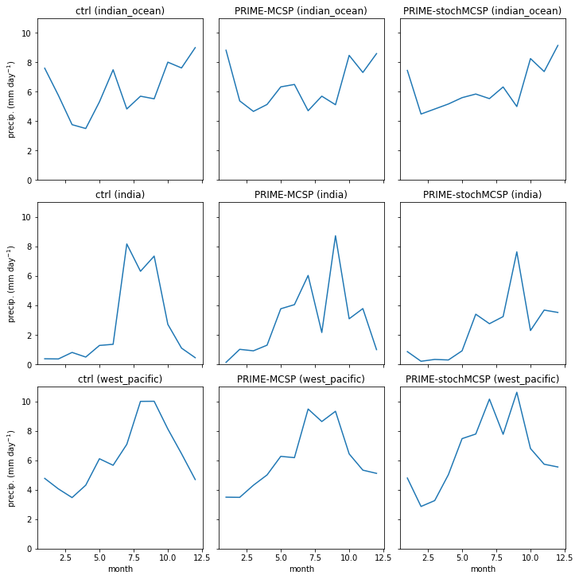
    


```python
gpcp_dir = Path('/gws/nopw/j04/mcs_prime/zhixiao/gpcp')
# GPCPMON_L3_198809_V3.2.nc4
ym = [
    (1988, 9),
    (1988, 10),
    (1988, 11),
    (1988, 12),
    (1989, 1),
    (1989, 2),
    (1989, 3),
    (1989, 4),
    (1989, 5),
    (1989, 6),
    (1989, 7),
    (1989, 8),
]
gpcp_paths = [
    gpcp_dir / f'GPCPMON_L3_{y}{m:02d}_V3.2.nc4'
    for y, m in ym
]
[(p, p.exists()) for p in gpcp_paths]
gpcp = xr.open_mfdataset(gpcp_paths)
```


```python
gpcp
```


<div><svg style="position: absolute; width: 0; height: 0; overflow: hidden">
<defs>
<symbol id="icon-database" viewBox="0 0 32 32">
<path d="M16 0c-8.837 0-16 2.239-16 5v4c0 2.761 7.163 5 16 5s16-2.239 16-5v-4c0-2.761-7.163-5-16-5z"></path>
<path d="M16 17c-8.837 0-16-2.239-16-5v6c0 2.761 7.163 5 16 5s16-2.239 16-5v-6c0 2.761-7.163 5-16 5z"></path>
<path d="M16 26c-8.837 0-16-2.239-16-5v6c0 2.761 7.163 5 16 5s16-2.239 16-5v-6c0 2.761-7.163 5-16 5z"></path>
</symbol>
<symbol id="icon-file-text2" viewBox="0 0 32 32">
<path d="M28.681 7.159c-0.694-0.947-1.662-2.053-2.724-3.116s-2.169-2.030-3.116-2.724c-1.612-1.182-2.393-1.319-2.841-1.319h-15.5c-1.378 0-2.5 1.121-2.5 2.5v27c0 1.378 1.122 2.5 2.5 2.5h23c1.378 0 2.5-1.122 2.5-2.5v-19.5c0-0.448-0.137-1.23-1.319-2.841zM24.543 5.457c0.959 0.959 1.712 1.825 2.268 2.543h-4.811v-4.811c0.718 0.556 1.584 1.309 2.543 2.268zM28 29.5c0 0.271-0.229 0.5-0.5 0.5h-23c-0.271 0-0.5-0.229-0.5-0.5v-27c0-0.271 0.229-0.5 0.5-0.5 0 0 15.499-0 15.5 0v7c0 0.552 0.448 1 1 1h7v19.5z"></path>
<path d="M23 26h-14c-0.552 0-1-0.448-1-1s0.448-1 1-1h14c0.552 0 1 0.448 1 1s-0.448 1-1 1z"></path>
<path d="M23 22h-14c-0.552 0-1-0.448-1-1s0.448-1 1-1h14c0.552 0 1 0.448 1 1s-0.448 1-1 1z"></path>
<path d="M23 18h-14c-0.552 0-1-0.448-1-1s0.448-1 1-1h14c0.552 0 1 0.448 1 1s-0.448 1-1 1z"></path>
</symbol>
</defs>
</svg>
<style>/* CSS stylesheet for displaying xarray objects in jupyterlab.
 *
 */

:root {
  --xr-font-color0: var(--jp-content-font-color0, rgba(0, 0, 0, 1));
  --xr-font-color2: var(--jp-content-font-color2, rgba(0, 0, 0, 0.54));
  --xr-font-color3: var(--jp-content-font-color3, rgba(0, 0, 0, 0.38));
  --xr-border-color: var(--jp-border-color2, #e0e0e0);
  --xr-disabled-color: var(--jp-layout-color3, #bdbdbd);
  --xr-background-color: var(--jp-layout-color0, white);
  --xr-background-color-row-even: var(--jp-layout-color1, white);
  --xr-background-color-row-odd: var(--jp-layout-color2, #eeeeee);
}

html[theme=dark],
body.vscode-dark {
  --xr-font-color0: rgba(255, 255, 255, 1);
  --xr-font-color2: rgba(255, 255, 255, 0.54);
  --xr-font-color3: rgba(255, 255, 255, 0.38);
  --xr-border-color: #1F1F1F;
  --xr-disabled-color: #515151;
  --xr-background-color: #111111;
  --xr-background-color-row-even: #111111;
  --xr-background-color-row-odd: #313131;
}

.xr-wrap {
  display: block !important;
  min-width: 300px;
  max-width: 700px;
}

.xr-text-repr-fallback {
  /* fallback to plain text repr when CSS is not injected (untrusted notebook) */
  display: none;
}

.xr-header {
  padding-top: 6px;
  padding-bottom: 6px;
  margin-bottom: 4px;
  border-bottom: solid 1px var(--xr-border-color);
}

.xr-header > div,
.xr-header > ul {
  display: inline;
  margin-top: 0;
  margin-bottom: 0;
}

.xr-obj-type,
.xr-array-name {
  margin-left: 2px;
  margin-right: 10px;
}

.xr-obj-type {
  color: var(--xr-font-color2);
}

.xr-sections {
  padding-left: 0 !important;
  display: grid;
  grid-template-columns: 150px auto auto 1fr 20px 20px;
}

.xr-section-item {
  display: contents;
}

.xr-section-item input {
  display: none;
}

.xr-section-item input + label {
  color: var(--xr-disabled-color);
}

.xr-section-item input:enabled + label {
  cursor: pointer;
  color: var(--xr-font-color2);
}

.xr-section-item input:enabled + label:hover {
  color: var(--xr-font-color0);
}

.xr-section-summary {
  grid-column: 1;
  color: var(--xr-font-color2);
  font-weight: 500;
}

.xr-section-summary > span {
  display: inline-block;
  padding-left: 0.5em;
}

.xr-section-summary-in:disabled + label {
  color: var(--xr-font-color2);
}

.xr-section-summary-in + label:before {
  display: inline-block;
  content: '►';
  font-size: 11px;
  width: 15px;
  text-align: center;
}

.xr-section-summary-in:disabled + label:before {
  color: var(--xr-disabled-color);
}

.xr-section-summary-in:checked + label:before {
  content: '▼';
}

.xr-section-summary-in:checked + label > span {
  display: none;
}

.xr-section-summary,
.xr-section-inline-details {
  padding-top: 4px;
  padding-bottom: 4px;
}

.xr-section-inline-details {
  grid-column: 2 / -1;
}

.xr-section-details {
  display: none;
  grid-column: 1 / -1;
  margin-bottom: 5px;
}

.xr-section-summary-in:checked ~ .xr-section-details {
  display: contents;
}

.xr-array-wrap {
  grid-column: 1 / -1;
  display: grid;
  grid-template-columns: 20px auto;
}

.xr-array-wrap > label {
  grid-column: 1;
  vertical-align: top;
}

.xr-preview {
  color: var(--xr-font-color3);
}

.xr-array-preview,
.xr-array-data {
  padding: 0 5px !important;
  grid-column: 2;
}

.xr-array-data,
.xr-array-in:checked ~ .xr-array-preview {
  display: none;
}

.xr-array-in:checked ~ .xr-array-data,
.xr-array-preview {
  display: inline-block;
}

.xr-dim-list {
  display: inline-block !important;
  list-style: none;
  padding: 0 !important;
  margin: 0;
}

.xr-dim-list li {
  display: inline-block;
  padding: 0;
  margin: 0;
}

.xr-dim-list:before {
  content: '(';
}

.xr-dim-list:after {
  content: ')';
}

.xr-dim-list li:not(:last-child):after {
  content: ',';
  padding-right: 5px;
}

.xr-has-index {
  font-weight: bold;
}

.xr-var-list,
.xr-var-item {
  display: contents;
}

.xr-var-item > div,
.xr-var-item label,
.xr-var-item > .xr-var-name span {
  background-color: var(--xr-background-color-row-even);
  margin-bottom: 0;
}

.xr-var-item > .xr-var-name:hover span {
  padding-right: 5px;
}

.xr-var-list > li:nth-child(odd) > div,
.xr-var-list > li:nth-child(odd) > label,
.xr-var-list > li:nth-child(odd) > .xr-var-name span {
  background-color: var(--xr-background-color-row-odd);
}

.xr-var-name {
  grid-column: 1;
}

.xr-var-dims {
  grid-column: 2;
}

.xr-var-dtype {
  grid-column: 3;
  text-align: right;
  color: var(--xr-font-color2);
}

.xr-var-preview {
  grid-column: 4;
}

.xr-var-name,
.xr-var-dims,
.xr-var-dtype,
.xr-preview,
.xr-attrs dt {
  white-space: nowrap;
  overflow: hidden;
  text-overflow: ellipsis;
  padding-right: 10px;
}

.xr-var-name:hover,
.xr-var-dims:hover,
.xr-var-dtype:hover,
.xr-attrs dt:hover {
  overflow: visible;
  width: auto;
  z-index: 1;
}

.xr-var-attrs,
.xr-var-data {
  display: none;
  background-color: var(--xr-background-color) !important;
  padding-bottom: 5px !important;
}

.xr-var-attrs-in:checked ~ .xr-var-attrs,
.xr-var-data-in:checked ~ .xr-var-data {
  display: block;
}

.xr-var-data > table {
  float: right;
}

.xr-var-name span,
.xr-var-data,
.xr-attrs {
  padding-left: 25px !important;
}

.xr-attrs,
.xr-var-attrs,
.xr-var-data {
  grid-column: 1 / -1;
}

dl.xr-attrs {
  padding: 0;
  margin: 0;
  display: grid;
  grid-template-columns: 125px auto;
}

.xr-attrs dt,
.xr-attrs dd {
  padding: 0;
  margin: 0;
  float: left;
  padding-right: 10px;
  width: auto;
}

.xr-attrs dt {
  font-weight: normal;
  grid-column: 1;
}

.xr-attrs dt:hover span {
  display: inline-block;
  background: var(--xr-background-color);
  padding-right: 10px;
}

.xr-attrs dd {
  grid-column: 2;
  white-space: pre-wrap;
  word-break: break-all;
}

.xr-icon-database,
.xr-icon-file-text2 {
  display: inline-block;
  vertical-align: middle;
  width: 1em;
  height: 1.5em !important;
  stroke-width: 0;
  stroke: currentColor;
  fill: currentColor;
}
</style><pre class='xr-text-repr-fallback'>&lt;xarray.Dataset&gt;
Dimensions:                   (lon: 720, lat: 360, time: 12, bnds: 2)
Coordinates:
  * lon                       (lon) float32 -179.8 -179.2 -178.8 ... 179.2 179.8
  * lat                       (lat) float32 89.75 89.25 88.75 ... -89.25 -89.75
  * time                      (time) datetime64[ns] 1988-09-01 ... 1989-08-01
Dimensions without coordinates: bnds
Data variables:
    sat_gauge_precip          (time, lat, lon) float32 dask.array&lt;chunksize=(1, 360, 720), meta=np.ndarray&gt;
    sat_gauge_error           (time, lat, lon) float32 dask.array&lt;chunksize=(1, 360, 720), meta=np.ndarray&gt;
    satellite_precip          (time, lat, lon) float32 dask.array&lt;chunksize=(1, 360, 720), meta=np.ndarray&gt;
    satellite_source          (time, lat, lon) float32 dask.array&lt;chunksize=(1, 360, 720), meta=np.ndarray&gt;
    gauge_precip              (time, lat, lon) float32 dask.array&lt;chunksize=(1, 360, 720), meta=np.ndarray&gt;
    probability_liquid_phase  (time, lat, lon) float32 dask.array&lt;chunksize=(1, 360, 720), meta=np.ndarray&gt;
    gauge_relative_weight     (time, lat, lon) float32 dask.array&lt;chunksize=(1, 360, 720), meta=np.ndarray&gt;
    quality_index             (time, lat, lon) float32 dask.array&lt;chunksize=(1, 360, 720), meta=np.ndarray&gt;
    time_bnds                 (time, bnds) datetime64[ns] dask.array&lt;chunksize=(1, 2), meta=np.ndarray&gt;
Attributes: (12/66)
    ShortName:                      GPCPMON
    LongName:                       GPCP Precipitation Level 3 Monthly 0.5-De...
    VersionID:                      3.2
    GranuleID:                      GPCPMON_L3_198809_V3.2.nc4
    Format:                         NetCDF-4
    RangeBeginningDate:             1988-09-01
    ...                             ...
    Distribution_Size:              Approximately 7 MB per file
    Distribution_Format:            NetCDF-4
    IdentifierProductDOIAuthority:  http://dx.doi.org/
    Fees:                           None
    ProcessingLevel:                Level 3
    Institution:                    Mesoscale Atmospheric Processes Laborator...</pre><div class='xr-wrap' style='display:none'><div class='xr-header'><div class='xr-obj-type'>xarray.Dataset</div></div><ul class='xr-sections'><li class='xr-section-item'><input id='section-90a3ae88-3d62-4398-8c18-14ed4322490e' class='xr-section-summary-in' type='checkbox' disabled ><label for='section-90a3ae88-3d62-4398-8c18-14ed4322490e' class='xr-section-summary'  title='Expand/collapse section'>Dimensions:</label><div class='xr-section-inline-details'><ul class='xr-dim-list'><li><span class='xr-has-index'>lon</span>: 720</li><li><span class='xr-has-index'>lat</span>: 360</li><li><span class='xr-has-index'>time</span>: 12</li><li><span>bnds</span>: 2</li></ul></div><div class='xr-section-details'></div></li><li class='xr-section-item'><input id='section-252c502c-29b5-4e69-ac04-cf444e8e1d83' class='xr-section-summary-in' type='checkbox'  checked><label for='section-252c502c-29b5-4e69-ac04-cf444e8e1d83' class='xr-section-summary' >Coordinates: <span>(3)</span></label><div class='xr-section-inline-details'></div><div class='xr-section-details'><ul class='xr-var-list'><li class='xr-var-item'><div class='xr-var-name'><span class='xr-has-index'>lon</span></div><div class='xr-var-dims'>(lon)</div><div class='xr-var-dtype'>float32</div><div class='xr-var-preview xr-preview'>-179.8 -179.2 ... 179.2 179.8</div><input id='attrs-271ed0f1-f2e0-493a-8abf-16d2158cd4d3' class='xr-var-attrs-in' type='checkbox' ><label for='attrs-271ed0f1-f2e0-493a-8abf-16d2158cd4d3' title='Show/Hide attributes'><svg class='icon xr-icon-file-text2'><use xlink:href='#icon-file-text2'></use></svg></label><input id='data-0a39731d-ca27-4437-a969-617d156cfb7c' class='xr-var-data-in' type='checkbox'><label for='data-0a39731d-ca27-4437-a969-617d156cfb7c' title='Show/Hide data repr'><svg class='icon xr-icon-database'><use xlink:href='#icon-database'></use></svg></label><div class='xr-var-attrs'><dl class='xr-attrs'><dt><span>long_name :</span></dt><dd>Longitude</dd><dt><span>units :</span></dt><dd>degrees_east</dd><dt><span>description :</span></dt><dd>Center longitude</dd></dl></div><div class='xr-var-data'><pre>array([-179.75, -179.25, -178.75, ...,  178.75,  179.25,  179.75],
      dtype=float32)</pre></div></li><li class='xr-var-item'><div class='xr-var-name'><span class='xr-has-index'>lat</span></div><div class='xr-var-dims'>(lat)</div><div class='xr-var-dtype'>float32</div><div class='xr-var-preview xr-preview'>89.75 89.25 88.75 ... -89.25 -89.75</div><input id='attrs-088f8044-824a-49ac-9c00-ec75a8be8713' class='xr-var-attrs-in' type='checkbox' ><label for='attrs-088f8044-824a-49ac-9c00-ec75a8be8713' title='Show/Hide attributes'><svg class='icon xr-icon-file-text2'><use xlink:href='#icon-file-text2'></use></svg></label><input id='data-334cc404-489a-4ea5-84d8-ce8b309d602b' class='xr-var-data-in' type='checkbox'><label for='data-334cc404-489a-4ea5-84d8-ce8b309d602b' title='Show/Hide data repr'><svg class='icon xr-icon-database'><use xlink:href='#icon-database'></use></svg></label><div class='xr-var-attrs'><dl class='xr-attrs'><dt><span>long_name :</span></dt><dd>Latitude</dd><dt><span>units :</span></dt><dd>degrees_north</dd><dt><span>description :</span></dt><dd>Center latitude</dd></dl></div><div class='xr-var-data'><pre>array([ 89.75,  89.25,  88.75, ..., -88.75, -89.25, -89.75], dtype=float32)</pre></div></li><li class='xr-var-item'><div class='xr-var-name'><span class='xr-has-index'>time</span></div><div class='xr-var-dims'>(time)</div><div class='xr-var-dtype'>datetime64[ns]</div><div class='xr-var-preview xr-preview'>1988-09-01 ... 1989-08-01</div><input id='attrs-1726acc0-91c0-4145-b8aa-183b386b0e8b' class='xr-var-attrs-in' type='checkbox' ><label for='attrs-1726acc0-91c0-4145-b8aa-183b386b0e8b' title='Show/Hide attributes'><svg class='icon xr-icon-file-text2'><use xlink:href='#icon-file-text2'></use></svg></label><input id='data-7a18f95f-025c-4749-9fff-a23a4a116fba' class='xr-var-data-in' type='checkbox'><label for='data-7a18f95f-025c-4749-9fff-a23a4a116fba' title='Show/Hide data repr'><svg class='icon xr-icon-database'><use xlink:href='#icon-database'></use></svg></label><div class='xr-var-attrs'><dl class='xr-attrs'><dt><span>long_name :</span></dt><dd>Time</dd><dt><span>description :</span></dt><dd>Observation Time</dd><dt><span>time_increment :</span></dt><dd>one month</dd><dt><span>begin_date :</span></dt><dd>19880901</dd><dt><span>begin_time :</span></dt><dd>000000</dd><dt><span>end_date :</span></dt><dd>19880930</dd><dt><span>end_time :</span></dt><dd>235959</dd><dt><span>bounds :</span></dt><dd>time_bnds</dd></dl></div><div class='xr-var-data'><pre>array([&#x27;1988-09-01T00:00:00.000000000&#x27;, &#x27;1988-10-01T00:00:00.000000000&#x27;,
       &#x27;1988-11-01T00:00:00.000000000&#x27;, &#x27;1988-12-01T00:00:00.000000000&#x27;,
       &#x27;1989-01-01T00:00:00.000000000&#x27;, &#x27;1989-02-01T00:00:00.000000000&#x27;,
       &#x27;1989-03-01T00:00:00.000000000&#x27;, &#x27;1989-04-01T00:00:00.000000000&#x27;,
       &#x27;1989-05-01T00:00:00.000000000&#x27;, &#x27;1989-06-01T00:00:00.000000000&#x27;,
       &#x27;1989-07-01T00:00:00.000000000&#x27;, &#x27;1989-08-01T00:00:00.000000000&#x27;],
      dtype=&#x27;datetime64[ns]&#x27;)</pre></div></li></ul></div></li><li class='xr-section-item'><input id='section-fc937138-6daa-445f-9855-72960499c451' class='xr-section-summary-in' type='checkbox'  checked><label for='section-fc937138-6daa-445f-9855-72960499c451' class='xr-section-summary' >Data variables: <span>(9)</span></label><div class='xr-section-inline-details'></div><div class='xr-section-details'><ul class='xr-var-list'><li class='xr-var-item'><div class='xr-var-name'><span>sat_gauge_precip</span></div><div class='xr-var-dims'>(time, lat, lon)</div><div class='xr-var-dtype'>float32</div><div class='xr-var-preview xr-preview'>dask.array&lt;chunksize=(1, 360, 720), meta=np.ndarray&gt;</div><input id='attrs-90105069-73ca-43dd-ab19-cb98b4b6763f' class='xr-var-attrs-in' type='checkbox' ><label for='attrs-90105069-73ca-43dd-ab19-cb98b4b6763f' title='Show/Hide attributes'><svg class='icon xr-icon-file-text2'><use xlink:href='#icon-file-text2'></use></svg></label><input id='data-34b13536-3a47-4593-95c9-ec5aa454f947' class='xr-var-data-in' type='checkbox'><label for='data-34b13536-3a47-4593-95c9-ec5aa454f947' title='Show/Hide data repr'><svg class='icon xr-icon-database'><use xlink:href='#icon-database'></use></svg></label><div class='xr-var-attrs'><dl class='xr-attrs'><dt><span>units :</span></dt><dd>mm/day</dd><dt><span>long_name :</span></dt><dd>combined satellite-gauge precipitation</dd><dt><span>valid_range :</span></dt><dd>[  0. 100.]</dd><dt><span>cell_methods :</span></dt><dd>time: mean</dd></dl></div><div class='xr-var-data'><table>
    <tr>
        <td>
            <table>
                <thead>
                    <tr>
                        <td> </td>
                        <th> Array </th>
                        <th> Chunk </th>
                    </tr>
                </thead>
                <tbody>

                    <tr>
                        <th> Bytes </th>
                        <td> 11.87 MiB </td>
                        <td> 0.99 MiB </td>
                    </tr>

                    <tr>
                        <th> Shape </th>
                        <td> (12, 360, 720) </td>
                        <td> (1, 360, 720) </td>
                    </tr>
                    <tr>
                        <th> Count </th>
                        <td> 36 Tasks </td>
                        <td> 12 Chunks </td>
                    </tr>
                    <tr>
                    <th> Type </th>
                    <td> float32 </td>
                    <td> numpy.ndarray </td>
                    </tr>
                </tbody>
            </table>
        </td>
        <td>
        <svg width="196" height="126" style="stroke:rgb(0,0,0);stroke-width:1" >

  <!-- Horizontal lines -->
  <line x1="10" y1="0" x2="26" y2="16" style="stroke-width:2" />
  <line x1="10" y1="60" x2="26" y2="76" style="stroke-width:2" />

  <!-- Vertical lines -->
  <line x1="10" y1="0" x2="10" y2="60" style="stroke-width:2" />
  <line x1="11" y1="1" x2="11" y2="61" />
  <line x1="12" y1="2" x2="12" y2="62" />
  <line x1="14" y1="4" x2="14" y2="64" />
  <line x1="15" y1="5" x2="15" y2="65" />
  <line x1="16" y1="6" x2="16" y2="66" />
  <line x1="18" y1="8" x2="18" y2="68" />
  <line x1="19" y1="9" x2="19" y2="69" />
  <line x1="20" y1="10" x2="20" y2="70" />
  <line x1="22" y1="12" x2="22" y2="72" />
  <line x1="23" y1="13" x2="23" y2="73" />
  <line x1="25" y1="15" x2="25" y2="75" />
  <line x1="26" y1="16" x2="26" y2="76" style="stroke-width:2" />

  <!-- Colored Rectangle -->
  <polygon points="10.0,0.0 26.484080952415905,16.484080952415905 26.484080952415905,76.48408095241591 10.0,60.0" style="fill:#ECB172A0;stroke-width:0"/>

  <!-- Horizontal lines -->
  <line x1="10" y1="0" x2="130" y2="0" style="stroke-width:2" />
  <line x1="11" y1="1" x2="131" y2="1" />
  <line x1="12" y1="2" x2="132" y2="2" />
  <line x1="14" y1="4" x2="134" y2="4" />
  <line x1="15" y1="5" x2="135" y2="5" />
  <line x1="16" y1="6" x2="136" y2="6" />
  <line x1="18" y1="8" x2="138" y2="8" />
  <line x1="19" y1="9" x2="139" y2="9" />
  <line x1="20" y1="10" x2="140" y2="10" />
  <line x1="22" y1="12" x2="142" y2="12" />
  <line x1="23" y1="13" x2="143" y2="13" />
  <line x1="25" y1="15" x2="145" y2="15" />
  <line x1="26" y1="16" x2="146" y2="16" style="stroke-width:2" />

  <!-- Vertical lines -->
  <line x1="10" y1="0" x2="26" y2="16" style="stroke-width:2" />
  <line x1="130" y1="0" x2="146" y2="16" style="stroke-width:2" />

  <!-- Colored Rectangle -->
  <polygon points="10.0,0.0 130.0,0.0 146.4840809524159,16.484080952415905 26.484080952415905,16.484080952415905" style="fill:#ECB172A0;stroke-width:0"/>

  <!-- Horizontal lines -->
  <line x1="26" y1="16" x2="146" y2="16" style="stroke-width:2" />
  <line x1="26" y1="76" x2="146" y2="76" style="stroke-width:2" />

  <!-- Vertical lines -->
  <line x1="26" y1="16" x2="26" y2="76" style="stroke-width:2" />
  <line x1="146" y1="16" x2="146" y2="76" style="stroke-width:2" />

  <!-- Colored Rectangle -->
  <polygon points="26.484080952415905,16.484080952415905 146.4840809524159,16.484080952415905 146.4840809524159,76.48408095241591 26.484080952415905,76.48408095241591" style="fill:#ECB172A0;stroke-width:0"/>

  <!-- Text -->
  <text x="86.484081" y="96.484081" font-size="1.0rem" font-weight="100" text-anchor="middle" >720</text>
  <text x="166.484081" y="46.484081" font-size="1.0rem" font-weight="100" text-anchor="middle" transform="rotate(-90,166.484081,46.484081)">360</text>
  <text x="8.242040" y="88.242040" font-size="1.0rem" font-weight="100" text-anchor="middle" transform="rotate(45,8.242040,88.242040)">12</text>
</svg>
        </td>
    </tr>
</table></div></li><li class='xr-var-item'><div class='xr-var-name'><span>sat_gauge_error</span></div><div class='xr-var-dims'>(time, lat, lon)</div><div class='xr-var-dtype'>float32</div><div class='xr-var-preview xr-preview'>dask.array&lt;chunksize=(1, 360, 720), meta=np.ndarray&gt;</div><input id='attrs-4eb640de-a7eb-4116-afb1-6d81a67d47d3' class='xr-var-attrs-in' type='checkbox' ><label for='attrs-4eb640de-a7eb-4116-afb1-6d81a67d47d3' title='Show/Hide attributes'><svg class='icon xr-icon-file-text2'><use xlink:href='#icon-file-text2'></use></svg></label><input id='data-0867a432-79d4-4146-aa9f-23acf45bd3c4' class='xr-var-data-in' type='checkbox'><label for='data-0867a432-79d4-4146-aa9f-23acf45bd3c4' title='Show/Hide data repr'><svg class='icon xr-icon-database'><use xlink:href='#icon-database'></use></svg></label><div class='xr-var-attrs'><dl class='xr-attrs'><dt><span>units :</span></dt><dd>mm/day</dd><dt><span>long_name :</span></dt><dd>combined satellite-gauge precipitation random error</dd><dt><span>valid_range :</span></dt><dd>[  0. 100.]</dd><dt><span>cell_methods :</span></dt><dd>time: mean</dd></dl></div><div class='xr-var-data'><table>
    <tr>
        <td>
            <table>
                <thead>
                    <tr>
                        <td> </td>
                        <th> Array </th>
                        <th> Chunk </th>
                    </tr>
                </thead>
                <tbody>

                    <tr>
                        <th> Bytes </th>
                        <td> 11.87 MiB </td>
                        <td> 0.99 MiB </td>
                    </tr>

                    <tr>
                        <th> Shape </th>
                        <td> (12, 360, 720) </td>
                        <td> (1, 360, 720) </td>
                    </tr>
                    <tr>
                        <th> Count </th>
                        <td> 36 Tasks </td>
                        <td> 12 Chunks </td>
                    </tr>
                    <tr>
                    <th> Type </th>
                    <td> float32 </td>
                    <td> numpy.ndarray </td>
                    </tr>
                </tbody>
            </table>
        </td>
        <td>
        <svg width="196" height="126" style="stroke:rgb(0,0,0);stroke-width:1" >

  <!-- Horizontal lines -->
  <line x1="10" y1="0" x2="26" y2="16" style="stroke-width:2" />
  <line x1="10" y1="60" x2="26" y2="76" style="stroke-width:2" />

  <!-- Vertical lines -->
  <line x1="10" y1="0" x2="10" y2="60" style="stroke-width:2" />
  <line x1="11" y1="1" x2="11" y2="61" />
  <line x1="12" y1="2" x2="12" y2="62" />
  <line x1="14" y1="4" x2="14" y2="64" />
  <line x1="15" y1="5" x2="15" y2="65" />
  <line x1="16" y1="6" x2="16" y2="66" />
  <line x1="18" y1="8" x2="18" y2="68" />
  <line x1="19" y1="9" x2="19" y2="69" />
  <line x1="20" y1="10" x2="20" y2="70" />
  <line x1="22" y1="12" x2="22" y2="72" />
  <line x1="23" y1="13" x2="23" y2="73" />
  <line x1="25" y1="15" x2="25" y2="75" />
  <line x1="26" y1="16" x2="26" y2="76" style="stroke-width:2" />

  <!-- Colored Rectangle -->
  <polygon points="10.0,0.0 26.484080952415905,16.484080952415905 26.484080952415905,76.48408095241591 10.0,60.0" style="fill:#ECB172A0;stroke-width:0"/>

  <!-- Horizontal lines -->
  <line x1="10" y1="0" x2="130" y2="0" style="stroke-width:2" />
  <line x1="11" y1="1" x2="131" y2="1" />
  <line x1="12" y1="2" x2="132" y2="2" />
  <line x1="14" y1="4" x2="134" y2="4" />
  <line x1="15" y1="5" x2="135" y2="5" />
  <line x1="16" y1="6" x2="136" y2="6" />
  <line x1="18" y1="8" x2="138" y2="8" />
  <line x1="19" y1="9" x2="139" y2="9" />
  <line x1="20" y1="10" x2="140" y2="10" />
  <line x1="22" y1="12" x2="142" y2="12" />
  <line x1="23" y1="13" x2="143" y2="13" />
  <line x1="25" y1="15" x2="145" y2="15" />
  <line x1="26" y1="16" x2="146" y2="16" style="stroke-width:2" />

  <!-- Vertical lines -->
  <line x1="10" y1="0" x2="26" y2="16" style="stroke-width:2" />
  <line x1="130" y1="0" x2="146" y2="16" style="stroke-width:2" />

  <!-- Colored Rectangle -->
  <polygon points="10.0,0.0 130.0,0.0 146.4840809524159,16.484080952415905 26.484080952415905,16.484080952415905" style="fill:#ECB172A0;stroke-width:0"/>

  <!-- Horizontal lines -->
  <line x1="26" y1="16" x2="146" y2="16" style="stroke-width:2" />
  <line x1="26" y1="76" x2="146" y2="76" style="stroke-width:2" />

  <!-- Vertical lines -->
  <line x1="26" y1="16" x2="26" y2="76" style="stroke-width:2" />
  <line x1="146" y1="16" x2="146" y2="76" style="stroke-width:2" />

  <!-- Colored Rectangle -->
  <polygon points="26.484080952415905,16.484080952415905 146.4840809524159,16.484080952415905 146.4840809524159,76.48408095241591 26.484080952415905,76.48408095241591" style="fill:#ECB172A0;stroke-width:0"/>

  <!-- Text -->
  <text x="86.484081" y="96.484081" font-size="1.0rem" font-weight="100" text-anchor="middle" >720</text>
  <text x="166.484081" y="46.484081" font-size="1.0rem" font-weight="100" text-anchor="middle" transform="rotate(-90,166.484081,46.484081)">360</text>
  <text x="8.242040" y="88.242040" font-size="1.0rem" font-weight="100" text-anchor="middle" transform="rotate(45,8.242040,88.242040)">12</text>
</svg>
        </td>
    </tr>
</table></div></li><li class='xr-var-item'><div class='xr-var-name'><span>satellite_precip</span></div><div class='xr-var-dims'>(time, lat, lon)</div><div class='xr-var-dtype'>float32</div><div class='xr-var-preview xr-preview'>dask.array&lt;chunksize=(1, 360, 720), meta=np.ndarray&gt;</div><input id='attrs-6dc9c5a8-92a1-44e2-9113-9c89d3bc608c' class='xr-var-attrs-in' type='checkbox' ><label for='attrs-6dc9c5a8-92a1-44e2-9113-9c89d3bc608c' title='Show/Hide attributes'><svg class='icon xr-icon-file-text2'><use xlink:href='#icon-file-text2'></use></svg></label><input id='data-fb21e7a7-476b-4634-a54d-2e0c2a9ace28' class='xr-var-data-in' type='checkbox'><label for='data-fb21e7a7-476b-4634-a54d-2e0c2a9ace28' title='Show/Hide data repr'><svg class='icon xr-icon-database'><use xlink:href='#icon-database'></use></svg></label><div class='xr-var-attrs'><dl class='xr-attrs'><dt><span>units :</span></dt><dd>mm/day</dd><dt><span>long_name :</span></dt><dd>multisatellite precipitation</dd><dt><span>valid_range :</span></dt><dd>[  0. 100.]</dd><dt><span>cell_methods :</span></dt><dd>time: mean</dd></dl></div><div class='xr-var-data'><table>
    <tr>
        <td>
            <table>
                <thead>
                    <tr>
                        <td> </td>
                        <th> Array </th>
                        <th> Chunk </th>
                    </tr>
                </thead>
                <tbody>

                    <tr>
                        <th> Bytes </th>
                        <td> 11.87 MiB </td>
                        <td> 0.99 MiB </td>
                    </tr>

                    <tr>
                        <th> Shape </th>
                        <td> (12, 360, 720) </td>
                        <td> (1, 360, 720) </td>
                    </tr>
                    <tr>
                        <th> Count </th>
                        <td> 36 Tasks </td>
                        <td> 12 Chunks </td>
                    </tr>
                    <tr>
                    <th> Type </th>
                    <td> float32 </td>
                    <td> numpy.ndarray </td>
                    </tr>
                </tbody>
            </table>
        </td>
        <td>
        <svg width="196" height="126" style="stroke:rgb(0,0,0);stroke-width:1" >

  <!-- Horizontal lines -->
  <line x1="10" y1="0" x2="26" y2="16" style="stroke-width:2" />
  <line x1="10" y1="60" x2="26" y2="76" style="stroke-width:2" />

  <!-- Vertical lines -->
  <line x1="10" y1="0" x2="10" y2="60" style="stroke-width:2" />
  <line x1="11" y1="1" x2="11" y2="61" />
  <line x1="12" y1="2" x2="12" y2="62" />
  <line x1="14" y1="4" x2="14" y2="64" />
  <line x1="15" y1="5" x2="15" y2="65" />
  <line x1="16" y1="6" x2="16" y2="66" />
  <line x1="18" y1="8" x2="18" y2="68" />
  <line x1="19" y1="9" x2="19" y2="69" />
  <line x1="20" y1="10" x2="20" y2="70" />
  <line x1="22" y1="12" x2="22" y2="72" />
  <line x1="23" y1="13" x2="23" y2="73" />
  <line x1="25" y1="15" x2="25" y2="75" />
  <line x1="26" y1="16" x2="26" y2="76" style="stroke-width:2" />

  <!-- Colored Rectangle -->
  <polygon points="10.0,0.0 26.484080952415905,16.484080952415905 26.484080952415905,76.48408095241591 10.0,60.0" style="fill:#ECB172A0;stroke-width:0"/>

  <!-- Horizontal lines -->
  <line x1="10" y1="0" x2="130" y2="0" style="stroke-width:2" />
  <line x1="11" y1="1" x2="131" y2="1" />
  <line x1="12" y1="2" x2="132" y2="2" />
  <line x1="14" y1="4" x2="134" y2="4" />
  <line x1="15" y1="5" x2="135" y2="5" />
  <line x1="16" y1="6" x2="136" y2="6" />
  <line x1="18" y1="8" x2="138" y2="8" />
  <line x1="19" y1="9" x2="139" y2="9" />
  <line x1="20" y1="10" x2="140" y2="10" />
  <line x1="22" y1="12" x2="142" y2="12" />
  <line x1="23" y1="13" x2="143" y2="13" />
  <line x1="25" y1="15" x2="145" y2="15" />
  <line x1="26" y1="16" x2="146" y2="16" style="stroke-width:2" />

  <!-- Vertical lines -->
  <line x1="10" y1="0" x2="26" y2="16" style="stroke-width:2" />
  <line x1="130" y1="0" x2="146" y2="16" style="stroke-width:2" />

  <!-- Colored Rectangle -->
  <polygon points="10.0,0.0 130.0,0.0 146.4840809524159,16.484080952415905 26.484080952415905,16.484080952415905" style="fill:#ECB172A0;stroke-width:0"/>

  <!-- Horizontal lines -->
  <line x1="26" y1="16" x2="146" y2="16" style="stroke-width:2" />
  <line x1="26" y1="76" x2="146" y2="76" style="stroke-width:2" />

  <!-- Vertical lines -->
  <line x1="26" y1="16" x2="26" y2="76" style="stroke-width:2" />
  <line x1="146" y1="16" x2="146" y2="76" style="stroke-width:2" />

  <!-- Colored Rectangle -->
  <polygon points="26.484080952415905,16.484080952415905 146.4840809524159,16.484080952415905 146.4840809524159,76.48408095241591 26.484080952415905,76.48408095241591" style="fill:#ECB172A0;stroke-width:0"/>

  <!-- Text -->
  <text x="86.484081" y="96.484081" font-size="1.0rem" font-weight="100" text-anchor="middle" >720</text>
  <text x="166.484081" y="46.484081" font-size="1.0rem" font-weight="100" text-anchor="middle" transform="rotate(-90,166.484081,46.484081)">360</text>
  <text x="8.242040" y="88.242040" font-size="1.0rem" font-weight="100" text-anchor="middle" transform="rotate(45,8.242040,88.242040)">12</text>
</svg>
        </td>
    </tr>
</table></div></li><li class='xr-var-item'><div class='xr-var-name'><span>satellite_source</span></div><div class='xr-var-dims'>(time, lat, lon)</div><div class='xr-var-dtype'>float32</div><div class='xr-var-preview xr-preview'>dask.array&lt;chunksize=(1, 360, 720), meta=np.ndarray&gt;</div><input id='attrs-583ae630-5a39-4ecf-ab9c-5205312817f0' class='xr-var-attrs-in' type='checkbox' ><label for='attrs-583ae630-5a39-4ecf-ab9c-5205312817f0' title='Show/Hide attributes'><svg class='icon xr-icon-file-text2'><use xlink:href='#icon-file-text2'></use></svg></label><input id='data-ecb7ef9f-3024-4162-9bf4-40637883049d' class='xr-var-data-in' type='checkbox'><label for='data-ecb7ef9f-3024-4162-9bf4-40637883049d' title='Show/Hide data repr'><svg class='icon xr-icon-database'><use xlink:href='#icon-database'></use></svg></label><div class='xr-var-attrs'><dl class='xr-attrs'><dt><span>units :</span></dt><dd>index value</dd><dt><span>long_name :</span></dt><dd>satellite source index</dd><dt><span>valid_range :</span></dt><dd>[0 4]</dd><dt><span>cell_methods :</span></dt><dd>time: mean</dd><dt><span>flag_values :</span></dt><dd>[0 2 4]</dd><dt><span>flag_meanings :</span></dt><dd>IR IR_AIRS_blend AIRS</dd></dl></div><div class='xr-var-data'><table>
    <tr>
        <td>
            <table>
                <thead>
                    <tr>
                        <td> </td>
                        <th> Array </th>
                        <th> Chunk </th>
                    </tr>
                </thead>
                <tbody>

                    <tr>
                        <th> Bytes </th>
                        <td> 11.87 MiB </td>
                        <td> 0.99 MiB </td>
                    </tr>

                    <tr>
                        <th> Shape </th>
                        <td> (12, 360, 720) </td>
                        <td> (1, 360, 720) </td>
                    </tr>
                    <tr>
                        <th> Count </th>
                        <td> 36 Tasks </td>
                        <td> 12 Chunks </td>
                    </tr>
                    <tr>
                    <th> Type </th>
                    <td> float32 </td>
                    <td> numpy.ndarray </td>
                    </tr>
                </tbody>
            </table>
        </td>
        <td>
        <svg width="196" height="126" style="stroke:rgb(0,0,0);stroke-width:1" >

  <!-- Horizontal lines -->
  <line x1="10" y1="0" x2="26" y2="16" style="stroke-width:2" />
  <line x1="10" y1="60" x2="26" y2="76" style="stroke-width:2" />

  <!-- Vertical lines -->
  <line x1="10" y1="0" x2="10" y2="60" style="stroke-width:2" />
  <line x1="11" y1="1" x2="11" y2="61" />
  <line x1="12" y1="2" x2="12" y2="62" />
  <line x1="14" y1="4" x2="14" y2="64" />
  <line x1="15" y1="5" x2="15" y2="65" />
  <line x1="16" y1="6" x2="16" y2="66" />
  <line x1="18" y1="8" x2="18" y2="68" />
  <line x1="19" y1="9" x2="19" y2="69" />
  <line x1="20" y1="10" x2="20" y2="70" />
  <line x1="22" y1="12" x2="22" y2="72" />
  <line x1="23" y1="13" x2="23" y2="73" />
  <line x1="25" y1="15" x2="25" y2="75" />
  <line x1="26" y1="16" x2="26" y2="76" style="stroke-width:2" />

  <!-- Colored Rectangle -->
  <polygon points="10.0,0.0 26.484080952415905,16.484080952415905 26.484080952415905,76.48408095241591 10.0,60.0" style="fill:#ECB172A0;stroke-width:0"/>

  <!-- Horizontal lines -->
  <line x1="10" y1="0" x2="130" y2="0" style="stroke-width:2" />
  <line x1="11" y1="1" x2="131" y2="1" />
  <line x1="12" y1="2" x2="132" y2="2" />
  <line x1="14" y1="4" x2="134" y2="4" />
  <line x1="15" y1="5" x2="135" y2="5" />
  <line x1="16" y1="6" x2="136" y2="6" />
  <line x1="18" y1="8" x2="138" y2="8" />
  <line x1="19" y1="9" x2="139" y2="9" />
  <line x1="20" y1="10" x2="140" y2="10" />
  <line x1="22" y1="12" x2="142" y2="12" />
  <line x1="23" y1="13" x2="143" y2="13" />
  <line x1="25" y1="15" x2="145" y2="15" />
  <line x1="26" y1="16" x2="146" y2="16" style="stroke-width:2" />

  <!-- Vertical lines -->
  <line x1="10" y1="0" x2="26" y2="16" style="stroke-width:2" />
  <line x1="130" y1="0" x2="146" y2="16" style="stroke-width:2" />

  <!-- Colored Rectangle -->
  <polygon points="10.0,0.0 130.0,0.0 146.4840809524159,16.484080952415905 26.484080952415905,16.484080952415905" style="fill:#ECB172A0;stroke-width:0"/>

  <!-- Horizontal lines -->
  <line x1="26" y1="16" x2="146" y2="16" style="stroke-width:2" />
  <line x1="26" y1="76" x2="146" y2="76" style="stroke-width:2" />

  <!-- Vertical lines -->
  <line x1="26" y1="16" x2="26" y2="76" style="stroke-width:2" />
  <line x1="146" y1="16" x2="146" y2="76" style="stroke-width:2" />

  <!-- Colored Rectangle -->
  <polygon points="26.484080952415905,16.484080952415905 146.4840809524159,16.484080952415905 146.4840809524159,76.48408095241591 26.484080952415905,76.48408095241591" style="fill:#ECB172A0;stroke-width:0"/>

  <!-- Text -->
  <text x="86.484081" y="96.484081" font-size="1.0rem" font-weight="100" text-anchor="middle" >720</text>
  <text x="166.484081" y="46.484081" font-size="1.0rem" font-weight="100" text-anchor="middle" transform="rotate(-90,166.484081,46.484081)">360</text>
  <text x="8.242040" y="88.242040" font-size="1.0rem" font-weight="100" text-anchor="middle" transform="rotate(45,8.242040,88.242040)">12</text>
</svg>
        </td>
    </tr>
</table></div></li><li class='xr-var-item'><div class='xr-var-name'><span>gauge_precip</span></div><div class='xr-var-dims'>(time, lat, lon)</div><div class='xr-var-dtype'>float32</div><div class='xr-var-preview xr-preview'>dask.array&lt;chunksize=(1, 360, 720), meta=np.ndarray&gt;</div><input id='attrs-84ae4fc7-02df-4564-9e21-4e3549da0046' class='xr-var-attrs-in' type='checkbox' ><label for='attrs-84ae4fc7-02df-4564-9e21-4e3549da0046' title='Show/Hide attributes'><svg class='icon xr-icon-file-text2'><use xlink:href='#icon-file-text2'></use></svg></label><input id='data-dde6e606-de46-4509-9472-e3c8619296d8' class='xr-var-data-in' type='checkbox'><label for='data-dde6e606-de46-4509-9472-e3c8619296d8' title='Show/Hide data repr'><svg class='icon xr-icon-database'><use xlink:href='#icon-database'></use></svg></label><div class='xr-var-attrs'><dl class='xr-attrs'><dt><span>units :</span></dt><dd>mm/day</dd><dt><span>long_name :</span></dt><dd>wind-loss adjusted gauge precipitation</dd><dt><span>valid_range :</span></dt><dd>[  0. 100.]</dd><dt><span>cell_methods :</span></dt><dd>time: mean</dd></dl></div><div class='xr-var-data'><table>
    <tr>
        <td>
            <table>
                <thead>
                    <tr>
                        <td> </td>
                        <th> Array </th>
                        <th> Chunk </th>
                    </tr>
                </thead>
                <tbody>

                    <tr>
                        <th> Bytes </th>
                        <td> 11.87 MiB </td>
                        <td> 0.99 MiB </td>
                    </tr>

                    <tr>
                        <th> Shape </th>
                        <td> (12, 360, 720) </td>
                        <td> (1, 360, 720) </td>
                    </tr>
                    <tr>
                        <th> Count </th>
                        <td> 36 Tasks </td>
                        <td> 12 Chunks </td>
                    </tr>
                    <tr>
                    <th> Type </th>
                    <td> float32 </td>
                    <td> numpy.ndarray </td>
                    </tr>
                </tbody>
            </table>
        </td>
        <td>
        <svg width="196" height="126" style="stroke:rgb(0,0,0);stroke-width:1" >

  <!-- Horizontal lines -->
  <line x1="10" y1="0" x2="26" y2="16" style="stroke-width:2" />
  <line x1="10" y1="60" x2="26" y2="76" style="stroke-width:2" />

  <!-- Vertical lines -->
  <line x1="10" y1="0" x2="10" y2="60" style="stroke-width:2" />
  <line x1="11" y1="1" x2="11" y2="61" />
  <line x1="12" y1="2" x2="12" y2="62" />
  <line x1="14" y1="4" x2="14" y2="64" />
  <line x1="15" y1="5" x2="15" y2="65" />
  <line x1="16" y1="6" x2="16" y2="66" />
  <line x1="18" y1="8" x2="18" y2="68" />
  <line x1="19" y1="9" x2="19" y2="69" />
  <line x1="20" y1="10" x2="20" y2="70" />
  <line x1="22" y1="12" x2="22" y2="72" />
  <line x1="23" y1="13" x2="23" y2="73" />
  <line x1="25" y1="15" x2="25" y2="75" />
  <line x1="26" y1="16" x2="26" y2="76" style="stroke-width:2" />

  <!-- Colored Rectangle -->
  <polygon points="10.0,0.0 26.484080952415905,16.484080952415905 26.484080952415905,76.48408095241591 10.0,60.0" style="fill:#ECB172A0;stroke-width:0"/>

  <!-- Horizontal lines -->
  <line x1="10" y1="0" x2="130" y2="0" style="stroke-width:2" />
  <line x1="11" y1="1" x2="131" y2="1" />
  <line x1="12" y1="2" x2="132" y2="2" />
  <line x1="14" y1="4" x2="134" y2="4" />
  <line x1="15" y1="5" x2="135" y2="5" />
  <line x1="16" y1="6" x2="136" y2="6" />
  <line x1="18" y1="8" x2="138" y2="8" />
  <line x1="19" y1="9" x2="139" y2="9" />
  <line x1="20" y1="10" x2="140" y2="10" />
  <line x1="22" y1="12" x2="142" y2="12" />
  <line x1="23" y1="13" x2="143" y2="13" />
  <line x1="25" y1="15" x2="145" y2="15" />
  <line x1="26" y1="16" x2="146" y2="16" style="stroke-width:2" />

  <!-- Vertical lines -->
  <line x1="10" y1="0" x2="26" y2="16" style="stroke-width:2" />
  <line x1="130" y1="0" x2="146" y2="16" style="stroke-width:2" />

  <!-- Colored Rectangle -->
  <polygon points="10.0,0.0 130.0,0.0 146.4840809524159,16.484080952415905 26.484080952415905,16.484080952415905" style="fill:#ECB172A0;stroke-width:0"/>

  <!-- Horizontal lines -->
  <line x1="26" y1="16" x2="146" y2="16" style="stroke-width:2" />
  <line x1="26" y1="76" x2="146" y2="76" style="stroke-width:2" />

  <!-- Vertical lines -->
  <line x1="26" y1="16" x2="26" y2="76" style="stroke-width:2" />
  <line x1="146" y1="16" x2="146" y2="76" style="stroke-width:2" />

  <!-- Colored Rectangle -->
  <polygon points="26.484080952415905,16.484080952415905 146.4840809524159,16.484080952415905 146.4840809524159,76.48408095241591 26.484080952415905,76.48408095241591" style="fill:#ECB172A0;stroke-width:0"/>

  <!-- Text -->
  <text x="86.484081" y="96.484081" font-size="1.0rem" font-weight="100" text-anchor="middle" >720</text>
  <text x="166.484081" y="46.484081" font-size="1.0rem" font-weight="100" text-anchor="middle" transform="rotate(-90,166.484081,46.484081)">360</text>
  <text x="8.242040" y="88.242040" font-size="1.0rem" font-weight="100" text-anchor="middle" transform="rotate(45,8.242040,88.242040)">12</text>
</svg>
        </td>
    </tr>
</table></div></li><li class='xr-var-item'><div class='xr-var-name'><span>probability_liquid_phase</span></div><div class='xr-var-dims'>(time, lat, lon)</div><div class='xr-var-dtype'>float32</div><div class='xr-var-preview xr-preview'>dask.array&lt;chunksize=(1, 360, 720), meta=np.ndarray&gt;</div><input id='attrs-0d29c427-e4a1-4fe6-86b3-f28dbd4f9035' class='xr-var-attrs-in' type='checkbox' ><label for='attrs-0d29c427-e4a1-4fe6-86b3-f28dbd4f9035' title='Show/Hide attributes'><svg class='icon xr-icon-file-text2'><use xlink:href='#icon-file-text2'></use></svg></label><input id='data-a395524b-5fa1-4031-9d8a-4f7876e56a65' class='xr-var-data-in' type='checkbox'><label for='data-a395524b-5fa1-4031-9d8a-4f7876e56a65' title='Show/Hide data repr'><svg class='icon xr-icon-database'><use xlink:href='#icon-database'></use></svg></label><div class='xr-var-attrs'><dl class='xr-attrs'><dt><span>units :</span></dt><dd>percent</dd><dt><span>long_name :</span></dt><dd>probability of liquid phase</dd><dt><span>valid_range :</span></dt><dd>[  0. 100.]</dd><dt><span>cell_methods :</span></dt><dd>time: mean</dd></dl></div><div class='xr-var-data'><table>
    <tr>
        <td>
            <table>
                <thead>
                    <tr>
                        <td> </td>
                        <th> Array </th>
                        <th> Chunk </th>
                    </tr>
                </thead>
                <tbody>

                    <tr>
                        <th> Bytes </th>
                        <td> 11.87 MiB </td>
                        <td> 0.99 MiB </td>
                    </tr>

                    <tr>
                        <th> Shape </th>
                        <td> (12, 360, 720) </td>
                        <td> (1, 360, 720) </td>
                    </tr>
                    <tr>
                        <th> Count </th>
                        <td> 36 Tasks </td>
                        <td> 12 Chunks </td>
                    </tr>
                    <tr>
                    <th> Type </th>
                    <td> float32 </td>
                    <td> numpy.ndarray </td>
                    </tr>
                </tbody>
            </table>
        </td>
        <td>
        <svg width="196" height="126" style="stroke:rgb(0,0,0);stroke-width:1" >

  <!-- Horizontal lines -->
  <line x1="10" y1="0" x2="26" y2="16" style="stroke-width:2" />
  <line x1="10" y1="60" x2="26" y2="76" style="stroke-width:2" />

  <!-- Vertical lines -->
  <line x1="10" y1="0" x2="10" y2="60" style="stroke-width:2" />
  <line x1="11" y1="1" x2="11" y2="61" />
  <line x1="12" y1="2" x2="12" y2="62" />
  <line x1="14" y1="4" x2="14" y2="64" />
  <line x1="15" y1="5" x2="15" y2="65" />
  <line x1="16" y1="6" x2="16" y2="66" />
  <line x1="18" y1="8" x2="18" y2="68" />
  <line x1="19" y1="9" x2="19" y2="69" />
  <line x1="20" y1="10" x2="20" y2="70" />
  <line x1="22" y1="12" x2="22" y2="72" />
  <line x1="23" y1="13" x2="23" y2="73" />
  <line x1="25" y1="15" x2="25" y2="75" />
  <line x1="26" y1="16" x2="26" y2="76" style="stroke-width:2" />

  <!-- Colored Rectangle -->
  <polygon points="10.0,0.0 26.484080952415905,16.484080952415905 26.484080952415905,76.48408095241591 10.0,60.0" style="fill:#ECB172A0;stroke-width:0"/>

  <!-- Horizontal lines -->
  <line x1="10" y1="0" x2="130" y2="0" style="stroke-width:2" />
  <line x1="11" y1="1" x2="131" y2="1" />
  <line x1="12" y1="2" x2="132" y2="2" />
  <line x1="14" y1="4" x2="134" y2="4" />
  <line x1="15" y1="5" x2="135" y2="5" />
  <line x1="16" y1="6" x2="136" y2="6" />
  <line x1="18" y1="8" x2="138" y2="8" />
  <line x1="19" y1="9" x2="139" y2="9" />
  <line x1="20" y1="10" x2="140" y2="10" />
  <line x1="22" y1="12" x2="142" y2="12" />
  <line x1="23" y1="13" x2="143" y2="13" />
  <line x1="25" y1="15" x2="145" y2="15" />
  <line x1="26" y1="16" x2="146" y2="16" style="stroke-width:2" />

  <!-- Vertical lines -->
  <line x1="10" y1="0" x2="26" y2="16" style="stroke-width:2" />
  <line x1="130" y1="0" x2="146" y2="16" style="stroke-width:2" />

  <!-- Colored Rectangle -->
  <polygon points="10.0,0.0 130.0,0.0 146.4840809524159,16.484080952415905 26.484080952415905,16.484080952415905" style="fill:#ECB172A0;stroke-width:0"/>

  <!-- Horizontal lines -->
  <line x1="26" y1="16" x2="146" y2="16" style="stroke-width:2" />
  <line x1="26" y1="76" x2="146" y2="76" style="stroke-width:2" />

  <!-- Vertical lines -->
  <line x1="26" y1="16" x2="26" y2="76" style="stroke-width:2" />
  <line x1="146" y1="16" x2="146" y2="76" style="stroke-width:2" />

  <!-- Colored Rectangle -->
  <polygon points="26.484080952415905,16.484080952415905 146.4840809524159,16.484080952415905 146.4840809524159,76.48408095241591 26.484080952415905,76.48408095241591" style="fill:#ECB172A0;stroke-width:0"/>

  <!-- Text -->
  <text x="86.484081" y="96.484081" font-size="1.0rem" font-weight="100" text-anchor="middle" >720</text>
  <text x="166.484081" y="46.484081" font-size="1.0rem" font-weight="100" text-anchor="middle" transform="rotate(-90,166.484081,46.484081)">360</text>
  <text x="8.242040" y="88.242040" font-size="1.0rem" font-weight="100" text-anchor="middle" transform="rotate(45,8.242040,88.242040)">12</text>
</svg>
        </td>
    </tr>
</table></div></li><li class='xr-var-item'><div class='xr-var-name'><span>gauge_relative_weight</span></div><div class='xr-var-dims'>(time, lat, lon)</div><div class='xr-var-dtype'>float32</div><div class='xr-var-preview xr-preview'>dask.array&lt;chunksize=(1, 360, 720), meta=np.ndarray&gt;</div><input id='attrs-a45ad1b9-c3f0-41d6-a644-e1e8797684c0' class='xr-var-attrs-in' type='checkbox' ><label for='attrs-a45ad1b9-c3f0-41d6-a644-e1e8797684c0' title='Show/Hide attributes'><svg class='icon xr-icon-file-text2'><use xlink:href='#icon-file-text2'></use></svg></label><input id='data-45b18ac0-8fb3-4e1f-84b3-c9020badd96c' class='xr-var-data-in' type='checkbox'><label for='data-45b18ac0-8fb3-4e1f-84b3-c9020badd96c' title='Show/Hide data repr'><svg class='icon xr-icon-database'><use xlink:href='#icon-database'></use></svg></label><div class='xr-var-attrs'><dl class='xr-attrs'><dt><span>units :</span></dt><dd>percent</dd><dt><span>long_name :</span></dt><dd>gauge relative weighting</dd><dt><span>valid_range :</span></dt><dd>[  0 100]</dd><dt><span>cell_methods :</span></dt><dd>time: mean</dd></dl></div><div class='xr-var-data'><table>
    <tr>
        <td>
            <table>
                <thead>
                    <tr>
                        <td> </td>
                        <th> Array </th>
                        <th> Chunk </th>
                    </tr>
                </thead>
                <tbody>

                    <tr>
                        <th> Bytes </th>
                        <td> 11.87 MiB </td>
                        <td> 0.99 MiB </td>
                    </tr>

                    <tr>
                        <th> Shape </th>
                        <td> (12, 360, 720) </td>
                        <td> (1, 360, 720) </td>
                    </tr>
                    <tr>
                        <th> Count </th>
                        <td> 36 Tasks </td>
                        <td> 12 Chunks </td>
                    </tr>
                    <tr>
                    <th> Type </th>
                    <td> float32 </td>
                    <td> numpy.ndarray </td>
                    </tr>
                </tbody>
            </table>
        </td>
        <td>
        <svg width="196" height="126" style="stroke:rgb(0,0,0);stroke-width:1" >

  <!-- Horizontal lines -->
  <line x1="10" y1="0" x2="26" y2="16" style="stroke-width:2" />
  <line x1="10" y1="60" x2="26" y2="76" style="stroke-width:2" />

  <!-- Vertical lines -->
  <line x1="10" y1="0" x2="10" y2="60" style="stroke-width:2" />
  <line x1="11" y1="1" x2="11" y2="61" />
  <line x1="12" y1="2" x2="12" y2="62" />
  <line x1="14" y1="4" x2="14" y2="64" />
  <line x1="15" y1="5" x2="15" y2="65" />
  <line x1="16" y1="6" x2="16" y2="66" />
  <line x1="18" y1="8" x2="18" y2="68" />
  <line x1="19" y1="9" x2="19" y2="69" />
  <line x1="20" y1="10" x2="20" y2="70" />
  <line x1="22" y1="12" x2="22" y2="72" />
  <line x1="23" y1="13" x2="23" y2="73" />
  <line x1="25" y1="15" x2="25" y2="75" />
  <line x1="26" y1="16" x2="26" y2="76" style="stroke-width:2" />

  <!-- Colored Rectangle -->
  <polygon points="10.0,0.0 26.484080952415905,16.484080952415905 26.484080952415905,76.48408095241591 10.0,60.0" style="fill:#ECB172A0;stroke-width:0"/>

  <!-- Horizontal lines -->
  <line x1="10" y1="0" x2="130" y2="0" style="stroke-width:2" />
  <line x1="11" y1="1" x2="131" y2="1" />
  <line x1="12" y1="2" x2="132" y2="2" />
  <line x1="14" y1="4" x2="134" y2="4" />
  <line x1="15" y1="5" x2="135" y2="5" />
  <line x1="16" y1="6" x2="136" y2="6" />
  <line x1="18" y1="8" x2="138" y2="8" />
  <line x1="19" y1="9" x2="139" y2="9" />
  <line x1="20" y1="10" x2="140" y2="10" />
  <line x1="22" y1="12" x2="142" y2="12" />
  <line x1="23" y1="13" x2="143" y2="13" />
  <line x1="25" y1="15" x2="145" y2="15" />
  <line x1="26" y1="16" x2="146" y2="16" style="stroke-width:2" />

  <!-- Vertical lines -->
  <line x1="10" y1="0" x2="26" y2="16" style="stroke-width:2" />
  <line x1="130" y1="0" x2="146" y2="16" style="stroke-width:2" />

  <!-- Colored Rectangle -->
  <polygon points="10.0,0.0 130.0,0.0 146.4840809524159,16.484080952415905 26.484080952415905,16.484080952415905" style="fill:#ECB172A0;stroke-width:0"/>

  <!-- Horizontal lines -->
  <line x1="26" y1="16" x2="146" y2="16" style="stroke-width:2" />
  <line x1="26" y1="76" x2="146" y2="76" style="stroke-width:2" />

  <!-- Vertical lines -->
  <line x1="26" y1="16" x2="26" y2="76" style="stroke-width:2" />
  <line x1="146" y1="16" x2="146" y2="76" style="stroke-width:2" />

  <!-- Colored Rectangle -->
  <polygon points="26.484080952415905,16.484080952415905 146.4840809524159,16.484080952415905 146.4840809524159,76.48408095241591 26.484080952415905,76.48408095241591" style="fill:#ECB172A0;stroke-width:0"/>

  <!-- Text -->
  <text x="86.484081" y="96.484081" font-size="1.0rem" font-weight="100" text-anchor="middle" >720</text>
  <text x="166.484081" y="46.484081" font-size="1.0rem" font-weight="100" text-anchor="middle" transform="rotate(-90,166.484081,46.484081)">360</text>
  <text x="8.242040" y="88.242040" font-size="1.0rem" font-weight="100" text-anchor="middle" transform="rotate(45,8.242040,88.242040)">12</text>
</svg>
        </td>
    </tr>
</table></div></li><li class='xr-var-item'><div class='xr-var-name'><span>quality_index</span></div><div class='xr-var-dims'>(time, lat, lon)</div><div class='xr-var-dtype'>float32</div><div class='xr-var-preview xr-preview'>dask.array&lt;chunksize=(1, 360, 720), meta=np.ndarray&gt;</div><input id='attrs-db53b1e0-b66f-42e9-9e5b-1805a24af553' class='xr-var-attrs-in' type='checkbox' ><label for='attrs-db53b1e0-b66f-42e9-9e5b-1805a24af553' title='Show/Hide attributes'><svg class='icon xr-icon-file-text2'><use xlink:href='#icon-file-text2'></use></svg></label><input id='data-cb6c8e99-7d07-4339-b4a4-bb2a5e90a6d8' class='xr-var-data-in' type='checkbox'><label for='data-cb6c8e99-7d07-4339-b4a4-bb2a5e90a6d8' title='Show/Hide data repr'><svg class='icon xr-icon-database'><use xlink:href='#icon-database'></use></svg></label><div class='xr-var-attrs'><dl class='xr-attrs'><dt><span>units :</span></dt><dd>1</dd><dt><span>long_name :</span></dt><dd>quality index</dd><dt><span>valid_range :</span></dt><dd>[  0. 700.]</dd><dt><span>cell_methods :</span></dt><dd>time: mean</dd></dl></div><div class='xr-var-data'><table>
    <tr>
        <td>
            <table>
                <thead>
                    <tr>
                        <td> </td>
                        <th> Array </th>
                        <th> Chunk </th>
                    </tr>
                </thead>
                <tbody>

                    <tr>
                        <th> Bytes </th>
                        <td> 11.87 MiB </td>
                        <td> 0.99 MiB </td>
                    </tr>

                    <tr>
                        <th> Shape </th>
                        <td> (12, 360, 720) </td>
                        <td> (1, 360, 720) </td>
                    </tr>
                    <tr>
                        <th> Count </th>
                        <td> 36 Tasks </td>
                        <td> 12 Chunks </td>
                    </tr>
                    <tr>
                    <th> Type </th>
                    <td> float32 </td>
                    <td> numpy.ndarray </td>
                    </tr>
                </tbody>
            </table>
        </td>
        <td>
        <svg width="196" height="126" style="stroke:rgb(0,0,0);stroke-width:1" >

  <!-- Horizontal lines -->
  <line x1="10" y1="0" x2="26" y2="16" style="stroke-width:2" />
  <line x1="10" y1="60" x2="26" y2="76" style="stroke-width:2" />

  <!-- Vertical lines -->
  <line x1="10" y1="0" x2="10" y2="60" style="stroke-width:2" />
  <line x1="11" y1="1" x2="11" y2="61" />
  <line x1="12" y1="2" x2="12" y2="62" />
  <line x1="14" y1="4" x2="14" y2="64" />
  <line x1="15" y1="5" x2="15" y2="65" />
  <line x1="16" y1="6" x2="16" y2="66" />
  <line x1="18" y1="8" x2="18" y2="68" />
  <line x1="19" y1="9" x2="19" y2="69" />
  <line x1="20" y1="10" x2="20" y2="70" />
  <line x1="22" y1="12" x2="22" y2="72" />
  <line x1="23" y1="13" x2="23" y2="73" />
  <line x1="25" y1="15" x2="25" y2="75" />
  <line x1="26" y1="16" x2="26" y2="76" style="stroke-width:2" />

  <!-- Colored Rectangle -->
  <polygon points="10.0,0.0 26.484080952415905,16.484080952415905 26.484080952415905,76.48408095241591 10.0,60.0" style="fill:#ECB172A0;stroke-width:0"/>

  <!-- Horizontal lines -->
  <line x1="10" y1="0" x2="130" y2="0" style="stroke-width:2" />
  <line x1="11" y1="1" x2="131" y2="1" />
  <line x1="12" y1="2" x2="132" y2="2" />
  <line x1="14" y1="4" x2="134" y2="4" />
  <line x1="15" y1="5" x2="135" y2="5" />
  <line x1="16" y1="6" x2="136" y2="6" />
  <line x1="18" y1="8" x2="138" y2="8" />
  <line x1="19" y1="9" x2="139" y2="9" />
  <line x1="20" y1="10" x2="140" y2="10" />
  <line x1="22" y1="12" x2="142" y2="12" />
  <line x1="23" y1="13" x2="143" y2="13" />
  <line x1="25" y1="15" x2="145" y2="15" />
  <line x1="26" y1="16" x2="146" y2="16" style="stroke-width:2" />

  <!-- Vertical lines -->
  <line x1="10" y1="0" x2="26" y2="16" style="stroke-width:2" />
  <line x1="130" y1="0" x2="146" y2="16" style="stroke-width:2" />

  <!-- Colored Rectangle -->
  <polygon points="10.0,0.0 130.0,0.0 146.4840809524159,16.484080952415905 26.484080952415905,16.484080952415905" style="fill:#ECB172A0;stroke-width:0"/>

  <!-- Horizontal lines -->
  <line x1="26" y1="16" x2="146" y2="16" style="stroke-width:2" />
  <line x1="26" y1="76" x2="146" y2="76" style="stroke-width:2" />

  <!-- Vertical lines -->
  <line x1="26" y1="16" x2="26" y2="76" style="stroke-width:2" />
  <line x1="146" y1="16" x2="146" y2="76" style="stroke-width:2" />

  <!-- Colored Rectangle -->
  <polygon points="26.484080952415905,16.484080952415905 146.4840809524159,16.484080952415905 146.4840809524159,76.48408095241591 26.484080952415905,76.48408095241591" style="fill:#ECB172A0;stroke-width:0"/>

  <!-- Text -->
  <text x="86.484081" y="96.484081" font-size="1.0rem" font-weight="100" text-anchor="middle" >720</text>
  <text x="166.484081" y="46.484081" font-size="1.0rem" font-weight="100" text-anchor="middle" transform="rotate(-90,166.484081,46.484081)">360</text>
  <text x="8.242040" y="88.242040" font-size="1.0rem" font-weight="100" text-anchor="middle" transform="rotate(45,8.242040,88.242040)">12</text>
</svg>
        </td>
    </tr>
</table></div></li><li class='xr-var-item'><div class='xr-var-name'><span>time_bnds</span></div><div class='xr-var-dims'>(time, bnds)</div><div class='xr-var-dtype'>datetime64[ns]</div><div class='xr-var-preview xr-preview'>dask.array&lt;chunksize=(1, 2), meta=np.ndarray&gt;</div><input id='attrs-df48b03d-68b5-4643-b0be-b2a3f4bf22dc' class='xr-var-attrs-in' type='checkbox' ><label for='attrs-df48b03d-68b5-4643-b0be-b2a3f4bf22dc' title='Show/Hide attributes'><svg class='icon xr-icon-file-text2'><use xlink:href='#icon-file-text2'></use></svg></label><input id='data-0f4d383c-3a3f-4df3-86bf-6ebe661fac00' class='xr-var-data-in' type='checkbox'><label for='data-0f4d383c-3a3f-4df3-86bf-6ebe661fac00' title='Show/Hide data repr'><svg class='icon xr-icon-database'><use xlink:href='#icon-database'></use></svg></label><div class='xr-var-attrs'><dl class='xr-attrs'><dt><span>long_name :</span></dt><dd>time bounds</dd></dl></div><div class='xr-var-data'><table>
    <tr>
        <td>
            <table>
                <thead>
                    <tr>
                        <td> </td>
                        <th> Array </th>
                        <th> Chunk </th>
                    </tr>
                </thead>
                <tbody>

                    <tr>
                        <th> Bytes </th>
                        <td> 192 B </td>
                        <td> 16 B </td>
                    </tr>

                    <tr>
                        <th> Shape </th>
                        <td> (12, 2) </td>
                        <td> (1, 2) </td>
                    </tr>
                    <tr>
                        <th> Count </th>
                        <td> 36 Tasks </td>
                        <td> 12 Chunks </td>
                    </tr>
                    <tr>
                    <th> Type </th>
                    <td> datetime64[ns] </td>
                    <td> numpy.ndarray </td>
                    </tr>
                </tbody>
            </table>
        </td>
        <td>
        <svg width="91" height="170" style="stroke:rgb(0,0,0);stroke-width:1" >

  <!-- Horizontal lines -->
  <line x1="0" y1="0" x2="41" y2="0" style="stroke-width:2" />
  <line x1="0" y1="10" x2="41" y2="10" />
  <line x1="0" y1="20" x2="41" y2="20" />
  <line x1="0" y1="30" x2="41" y2="30" />
  <line x1="0" y1="40" x2="41" y2="40" />
  <line x1="0" y1="50" x2="41" y2="50" />
  <line x1="0" y1="60" x2="41" y2="60" />
  <line x1="0" y1="70" x2="41" y2="70" />
  <line x1="0" y1="80" x2="41" y2="80" />
  <line x1="0" y1="90" x2="41" y2="90" />
  <line x1="0" y1="100" x2="41" y2="100" />
  <line x1="0" y1="110" x2="41" y2="110" />
  <line x1="0" y1="120" x2="41" y2="120" style="stroke-width:2" />

  <!-- Vertical lines -->
  <line x1="0" y1="0" x2="0" y2="120" style="stroke-width:2" />
  <line x1="41" y1="0" x2="41" y2="120" style="stroke-width:2" />

  <!-- Colored Rectangle -->
  <polygon points="0.0,0.0 41.20382942136741,0.0 41.20382942136741,120.0 0.0,120.0" style="fill:#ECB172A0;stroke-width:0"/>

  <!-- Text -->
  <text x="20.601915" y="140.000000" font-size="1.0rem" font-weight="100" text-anchor="middle" >2</text>
  <text x="61.203829" y="60.000000" font-size="1.0rem" font-weight="100" text-anchor="middle" transform="rotate(0,61.203829,60.000000)">12</text>
</svg>
        </td>
    </tr>
</table></div></li></ul></div></li><li class='xr-section-item'><input id='section-83d140dd-12a0-4a3f-ac59-3d0455b3972e' class='xr-section-summary-in' type='checkbox'  ><label for='section-83d140dd-12a0-4a3f-ac59-3d0455b3972e' class='xr-section-summary' >Attributes: <span>(66)</span></label><div class='xr-section-inline-details'></div><div class='xr-section-details'><dl class='xr-attrs'><dt><span>ShortName :</span></dt><dd>GPCPMON</dd><dt><span>LongName :</span></dt><dd>GPCP Precipitation Level 3 Monthly 0.5-Degree V3.2</dd><dt><span>VersionID :</span></dt><dd>3.2</dd><dt><span>GranuleID :</span></dt><dd>GPCPMON_L3_198809_V3.2.nc4</dd><dt><span>Format :</span></dt><dd>NetCDF-4</dd><dt><span>RangeBeginningDate :</span></dt><dd>1988-09-01</dd><dt><span>RangeBeginningTime :</span></dt><dd>00:00:00.000000</dd><dt><span>RangeEndingDate :</span></dt><dd>1988-09-30</dd><dt><span>RangeEndingTime :</span></dt><dd>23:59:59.999999</dd><dt><span>ProductionDateTime :</span></dt><dd>2022-01-12T12:45:00Z</dd><dt><span>Conventions :</span></dt><dd>CF-1.5</dd><dt><span>NorthernmostLatitude :</span></dt><dd>90.0</dd><dt><span>SouthernmostLatitude :</span></dt><dd>-90.0</dd><dt><span>WesternmostLongitude :</span></dt><dd>-180.0</dd><dt><span>EasternmostLongitude :</span></dt><dd>180.0</dd><dt><span>LatitudeResolution :</span></dt><dd>0.5</dd><dt><span>LongitudeResolution :</span></dt><dd>0.5</dd><dt><span>Entry_ID :</span></dt><dd>GPCPMON_3.2</dd><dt><span>Entry_Title :</span></dt><dd>GPCP Precipitation Level 3 Monthly 0.5-Degree V3.2 (GPCPMON) at GES DISC</dd><dt><span>Title :</span></dt><dd>GPCP Precipitation Level 3 Monthly 0.5-Degree V3.2</dd><dt><span>Science_Keywords :</span></dt><dd>EARTH SCIENCE &gt; ATMOSPHERE &gt; PRECIPITATION &gt; PRECIPITATION RATE</dd><dt><span>ISO_Topic_Category :</span></dt><dd>Climatology/Meteorology/Atmosphere</dd><dt><span>Data_Center_ShortName :</span></dt><dd>NASA/GSFC/SED/ESD/GCDC/GESDISC</dd><dt><span>Data_Center_LongName :</span></dt><dd>Goddard Earth Sciences Data and Information Services Center (formerly Goddard DAAC),Global Change Data Center, Earth Sciences Division, Science and Exploration Directorate, Goddard Space Flight Center, NASA</dd><dt><span>Data_Center_URL :</span></dt><dd>https://disc.gsfc.nasa.gov/</dd><dt><span>Data_Center_Role :</span></dt><dd>DATA CENTER CONTACT</dd><dt><span>Data_Center_Last_Name :</span></dt><dd>GES DISC help Desk Support Group</dd><dt><span>Data_Center_Email :</span></dt><dd>gsfc-dl-help-disc@mail.nasa.gov</dd><dt><span>Data_Center_Phone :</span></dt><dd>301-614-5224</dd><dt><span>Data_Center_Fax :</span></dt><dd>301-614-5268</dd><dt><span>Data_Center_Address :</span></dt><dd>Goddard Earth Sciences Data and Information Services Center, Code 610.2, NASA Goddard Space Flight Center, Greenbelt, MD, 20771, USA</dd><dt><span>Data_Set_Progress :</span></dt><dd>Stable Version</dd><dt><span>DataSetQuality :</span></dt><dd>A rudimentary estimate of the quality of the precipitation estimates is provided in the combined satellite-gauge precipitation random error field.  The method used to estimate the random error is based on the technique described in Huffman (1997).  In general, estimating meaningful error is a difficult prospect and is currently the subject of  intensive research.  Since inception, the GPCP has strived to maintain CDR standards in all its data sets, despite not officially being a CDR.  Homogeneity in the record takes precedence over instantaneous accuracy.  Over the long-term, GPCP represents the current state of the art.  GPCP estimates are most accurate in the tropics, and less so in the subtropics and mid-latitudes.  Above 58N and below 58S, the estimates are more approximate.  High-quality gauge analyses are incorporated to vastly improve the estimates over land.  Note that the land estimates are of lesser quality in the more challenging regions such as complex terrain and snow and ice covered surfaces.  The GPCP estimates are most appropriate for studies where a long record is necessary, but less useful for short-interval studies and the examination of extremes.</dd><dt><span>Summary :</span></dt><dd>The Global Precipitation Climatology Project (GPCP) is the precipitation component of an internationally coordinated set of (mainly) satellite-based global products dealing with the Earth&#x27;s water and energy cycles, under the auspices of the Global Water and Energy Experiment (GEWEX) Data and Assessment Panel (GDAP) of the World Climate Research Program.  As the follow on to the GPCP Version 2.X products, GPCP Version 3 (GPCP V3.2) seeks to continue the long, homogeneous precipitation record using modern merging techniques and input data sets.  The GPCPV3 suite currently consists the 0.5-degree monthly and daily products.  A follow-on 0.1-degree 3-hourly is expected.  All GPCPV3 products will be internally consistent. The monthly product spans 1983 - 2020. Inputs consist of the GPROF SSMI/SSMIS orbit files that are used to calibrate the PERSIANN-CDR IR-based precipitation in the span 60NS, which are in turn calibrated to the monthly 2.5-degree METH product.  The METH-GPROF-adjusted PERSIANN-CDR IR estimates are then climatologically adjusted to the blended TCC/MCTG.  Outside of 58NS, TOVS/AIRS estimates, adjusted climatologically to the MCTG, are used.  The PERSIANN-CDR / TOVS/AIRS estimates are then merged in the region 35NS-58NS, which are then merged with GPCC gauge analyses over land to obtain the final product. In addition to the final precipitation field, ancillary precipitation and error estimates are provided.</dd><dt><span>Validation_Data :</span></dt><dd>Validation of the GPCPV3 data sets is currently in process.  Previous validation efforts for GPCPV2.2 included comparisons with high-density rain gauge data sets (not part of the GPCC gauge analysis) and PACRAIN atoll gauges.</dd><dt><span>Source :</span></dt><dd>The input satellite data sources can be found in the satellite source index field.  Note that gauge analyses are always included over land.</dd><dt><span>MapProjection :</span></dt><dd>Cylindrical Equidistant</dd><dt><span>RelatedURL :</span></dt><dd>https://earthdata.nasa.gov/esds/competitive-programs/measures/long-term-gpcp-precipitation</dd><dt><span>Dataset_Creator :</span></dt><dd>George J. Huffman and David T. Bolvin</dd><dt><span>Dataset_Title :</span></dt><dd>GPCP Precipitation Level 3 Monthly 0.5-Degree V3.2</dd><dt><span>Dataset_Series_Name :</span></dt><dd>GPCPMON</dd><dt><span>Dataset_Release_Date :</span></dt><dd>2022-01-22</dd><dt><span>Dataset_Release_Place :</span></dt><dd>Greenbelt, MD, USA</dd><dt><span>Dataset_Publisher :</span></dt><dd>Goddard Earth Sciences Data and Information Services Center (GES DISC)</dd><dt><span>IdentifierProductDOI :</span></dt><dd>10.5067/MEASURES/GPCP/DATA304</dd><dt><span>Data_Presentation_Form :</span></dt><dd>Digital Science Data</dd><dt><span>References :</span></dt><dd>Data set references will be provided</dd><dt><span>Role :</span></dt><dd>INVESTIGATOR</dd><dt><span>First_Name :</span></dt><dd>George</dd><dt><span>Last_Name :</span></dt><dd>Huffman</dd><dt><span>Phone :</span></dt><dd>301-614-6308</dd><dt><span>FAX :</span></dt><dd>301-614-5492</dd><dt><span>Email :</span></dt><dd>george.j.huffman@nasa.gov</dd><dt><span>Contact_Address :</span></dt><dd>Mesoscale Atmospheric Processes Laboratory, Code 612.0, NASA Goddard Space Flight Center</dd><dt><span>City :</span></dt><dd>Greenbelt</dd><dt><span>Provence_or_State :</span></dt><dd>MD</dd><dt><span>Postal_Code :</span></dt><dd>20771</dd><dt><span>Country :</span></dt><dd>USA</dd><dt><span>Use_Constraints :</span></dt><dd>This data set continues to be validated. Please contact George Huffman, email: george.j.huffman@nasa.gov, for current known problems and updates.</dd><dt><span>Distribution_Media :</span></dt><dd>Online Archive</dd><dt><span>Distribution_Size :</span></dt><dd>Approximately 7 MB per file</dd><dt><span>Distribution_Format :</span></dt><dd>NetCDF-4</dd><dt><span>IdentifierProductDOIAuthority :</span></dt><dd>http://dx.doi.org/</dd><dt><span>Fees :</span></dt><dd>None</dd><dt><span>ProcessingLevel :</span></dt><dd>Level 3</dd><dt><span>Institution :</span></dt><dd>Mesoscale Atmospheric Processes Laboratory, NASA GSFC</dd></dl></div></li></ul></div></div>


```python
monthly_data['gpcp'] = {}
gpcp_tindex = pd.DatetimeIndex(gpcp.time)
for bname in boxes.keys():
    monthly_data['gpcp'][bname] = []
for m in range(12):
    pmonth = gpcp.isel(time=gpcp_tindex.month == m + 1)
    #print(pmonth)
    for bname, bcoords in boxes.items():
        minx, maxx, miny, maxy = bcoords
        pmonth_box = pmonth.sel(lon=slice(minx, maxx), lat=slice(maxy, miny))
        # monthly_data[suite][bname].append(pmonth_box.values.mean() * 3600 * 24)
        monthly_data['gpcp'][bname].append(pmonth_box.satellite_precip.values.mean())
```


```python

```


```python

```


```python

```


```python

```


```python
fig, axes = plt.subplots(3, 3, layout='constrained', sharex=True, sharey=True)
fig.set_size_inches(10, 10)
for axrow, bname in zip(axes, boxes.keys()):
    for ax, suite in zip(axrow, suites):
        ax.set_title(f'{suites[suite]} ({bname})')
        ax.plot(range(1, 13), monthly_data[suite][bname], label='sim')
        ax.plot(range(1, 13), monthly_data['gpcp'][bname], 'k', label='obs')
        ax.set_ylim((0, 11))
        ax.set_xticks(range(1, 13))
        # ax.set_xticklabels([9, 10, 11, 12, 1, 2, 3, 4, 5, 6, 7, 8])
for ax in axes[-1]:
    ax.set_xlabel('month')
for ax in axes[:, 0]:
    ax.set_ylabel('precip. (mm day$^{-1}$)')
axes[0, -1].legend()
    
```


    <matplotlib.legend.Legend at 0x7f5d9974a9b0>


    
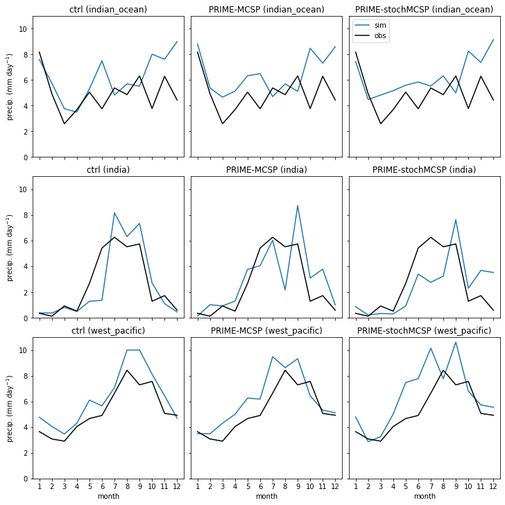
    


```python
# gpcp.cf.bounds
```


    ---------------------------------------------------------------------------

    AttributeError                            Traceback (most recent call last)

    Input In [42], in <cell line: 1>()
    ----> 1 gpcp.cf.bounds


    File ~/miniconda3/envs/mcs_prime_env/lib/python3.10/site-packages/xarray/core/common.py:239, in AttrAccessMixin.__getattr__(self, name)
        237         with suppress(KeyError):
        238             return source[name]
    --> 239 raise AttributeError(
        240     f"{type(self).__name__!r} object has no attribute {name!r}"
        241 )


    AttributeError: 'Dataset' object has no attribute 'cf'


```python
# pflux.cf
```


```python
# Regrid OBS
import xesmf as xe
# pflux.cf has no bounds, meaning conservative gregridding won't work for now
# Perform conservative regridding
# regridder = xe.Regridder(gpcp.satellite_precip, pflux, method='conservative')
regridder = xe.Regridder(gpcp.satellite_precip, pflux, method='bilinear')
regridded_gpcp = regridder(gpcp.satellite_precip)

# Print the regridded precipitation rate data
# print("Regridded precipitation rate data:")
print(regridded_gpcp)


```

    /home/users/mmuetz/miniconda3/envs/mcs_prime_env/lib/python3.10/site-packages/dask/array/core.py:456: FutureWarning: elementwise comparison failed; returning scalar instead, but in the future will perform elementwise comparison
      o = func(*args, **kwargs)
    /home/users/mmuetz/miniconda3/envs/mcs_prime_env/lib/python3.10/site-packages/xarray/core/dataarray.py:780: FutureWarning: elementwise comparison failed; returning scalar instead, but in the future will perform elementwise comparison
      return key in self.data


    <xarray.DataArray (time: 12, latitude: 144, longitude: 192)>
    dask.array<_regrid, shape=(12, 144, 192), dtype=float32, chunksize=(1, 144, 192), chunktype=numpy.ndarray>
    Coordinates:
      * time       (time) datetime64[ns] 1988-09-01 1988-10-01 ... 1989-08-01
      * longitude  (longitude) float32 0.9375 2.812 4.688 ... 355.3 357.2 359.1
      * latitude   (latitude) float32 -89.38 -88.12 -86.88 ... 86.88 88.12 89.38
    Attributes:
        regrid_method:  bilinear


```python

```


```python
def plot_suites4(suites, suite_data):
    gpcp_mean = regridded_gpcp.mean(dim='time')
    fig, axes = plt.subplots(2, 2, subplot_kw={'projection': ccrs.PlateCarree()}, layout='constrained')
    fig.set_size_inches((16, 8))
    # axes[1, 0].axis('off')
    im = axes[0, 0].contourf(
        gpcp_mean.longitude, gpcp_mean.latitude, 
        gpcp_mean, cmap=cmap, levels=np.linspace(0, 11, 12), extend='max'
    )
    axes[0, 0].set_title('GPCP')
    axes[0, 0].coastlines()
    
    for suite, ax in zip(suites.keys(), axes.flatten()[1:]):
        pflux = suite_data[suite]
        # im = (pflux * 3600 * 24 - ctrl_pflux * 3600 * 24).plot(ax=ax, cmap=cmap2, levels=np.linspace(-3, 3, 11), add_colorbar=False)
        im = ax.contourf(pflux.longitude, pflux.latitude, pflux * 3600 * 24 - gpcp_mean, cmap=cmap2, levels=np.linspace(-5, 5, 11), extend='both')
        ax.set_title(f'{suites[suite]} - GPCP')
        ax.coastlines()
    plt.colorbar(im, ax=axes, label='$\Delta$ precip. (mm day$^{-1}$)')

    for ax in axes.flatten():
        gl = ax.gridlines(crs=ccrs.PlateCarree(), draw_labels=True, linewidth=1, color='gray')
        gl.xlocator = mticker.FixedLocator(np.arange(-180, 181, 45))
        gl.ylocator = mticker.FixedLocator(np.arange(-90, 90, 45))
        
        gl.top_labels = False
        gl.right_labels = False
        for bname, bcoords in boxes.items():
            minx, maxx, miny, maxy = bcoords
            bpoints = ((minx, miny), (minx, maxy), (maxx, maxy), (maxx, miny))
            box = shapely.geometry.LinearRing(bpoints)
            # Add geometry for each nested grid size.
            ax.add_geometries([box], crs=ccrs.PlateCarree(), edgecolor='magenta', facecolor='none', lw=3)
            

plot_suites4(suites, suite_data)
```


    
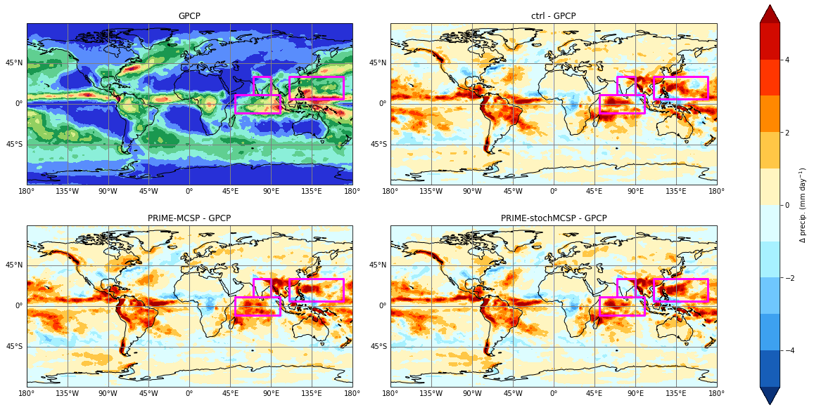
    


```python

```


```python

```


```python
pflux_ctrl = suite_data_daily['u-dg040'].std(dim='dim0')

for suite in suites.keys():
    pflux = suite_data_daily[suite].std(dim='dim0')
    print(np.abs(np.percentile(pflux.values.flatten() * 3600 * 24, 99)).max())
    print(np.abs(np.percentile((pflux.values.flatten() - pflux_ctrl.values.flatten()) * 3600 * 24, [1, 99])).max())
    
```

    16.724859962463345
    0.0
    15.24712606430053
    4.595546870231629
    16.323714485168438
    4.392118802070618


```python
def plot_suites5(suites, suite_data):
    fig, axes = plt.subplots(2, 3, subplot_kw={'projection': ccrs.PlateCarree()}, layout='constrained')
    fig.set_size_inches((24, 8))
    axes[1, 0].axis('off')
    for suite, ax in zip(suites.keys(), axes[0]):
        pflux = suite_data_daily[suite]
        im = (pflux.std(dim='dim0') * 3600 * 24).plot(ax=ax, cmap=cmap, levels=np.linspace(0, 16.7, 11), add_colorbar=False)
        ax.set_title(suites[suite])
        if suites[suite] == 'ctrl':
            ctrl_pflux = pflux
        ax.coastlines()
    plt.colorbar(im, ax=axes[0], label='std. precip. (mm day$^{-1}$)')
    for suite, ax in zip(suites.keys(), axes[1]):
        if suites[suite] == 'ctrl':
            continue
        pflux = suite_data_daily[suite]
        im = (pflux.std(dim='dim0') * 3600 * 24 - ctrl_pflux.std(dim='dim0') * 3600 * 24).plot(ax=ax, cmap=cmap2, levels=np.linspace(-4.6, 4.6, 11), add_colorbar=False)
        ax.set_title(f'{suites[suite]} - ctrl')
        ax.coastlines()
    plt.colorbar(im, ax=axes[1], label='$\Delta$ std. precip. (mm day$^{-1}$)')

    for ax in axes[0, 1:]:
        gl = ax.gridlines(crs=ccrs.PlateCarree(), draw_labels=False, linewidth=1, color='gray')
        gl.xlocator = mticker.FixedLocator(np.arange(-180, 181, 45))
        gl.ylocator = mticker.FixedLocator(np.arange(-90, 90, 45))
    for idx in [(0, 0), (1, 1), (1, 2)]:
        ax = axes[idx]
        gl = ax.gridlines(crs=ccrs.PlateCarree(), draw_labels=True, linewidth=1, color='gray')
        gl.xlocator = mticker.FixedLocator(np.arange(-180, 181, 45))
        gl.ylocator = mticker.FixedLocator(np.arange(-90, 90, 45))
        gl.top_labels = False
        gl.right_labels = False
        if idx == (1, 2):
            gl.left_labels = False
            

plot_suites5(suites, suite_data)
```


    
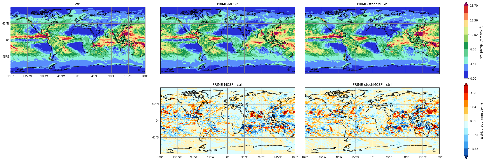
    


```python

```


```python

```


```python

```


```python

```


```python

```


```python

```


```python

```


```python
raise Exception('dev code below')
```


    ---------------------------------------------------------------------------

    Exception                                 Traceback (most recent call last)

    Input In [46], in <cell line: 1>()
    ----> 1 raise Exception('dev code below')


    Exception: dev code below


```python
pflux0 = suite_data['u-dg040']
```


```python
fig, ax = plt.subplots(subplot_kw={'projection': ccrs.PlateCarree()})
fig.set_size_inches((12, 5))
(pflux0 * 3600 * 24).plot(ax=ax, cmap='plasma', levels=np.linspace(0, 15, 16), add_colorbar=False)
ax.set_title('ctrl')
ax.coastlines()
```


```python
pd_paths = sorted((simdir / 'u-dg040').glob('dg040a.pd*.pp'))
nc_paths = sorted((simdir / 'u-dg040').glob('dg040a.pd*.nc'))
```


```python
# df = xr.open_mfdataset(nc_paths)

```


```python
# Necessary to get just precipitation_flux that has been averaged daily.
pflux_hour_12 = iris.Constraint(name='precipitation_flux', time=lambda cell: (cell.point.hour == 12) and (cell.point.minute == 0))
cubes = iris.load(pd_paths[:3], constraints=pflux_hour_12)
```


```python
pflux_cube = cubes[0]
da = xr.DataArray.from_iris(pflux_cube)
```


```python
df = xr.open_dataset(nc_paths[0])
tindex = xr.CFTimeIndex(df.precipitation_flux.time_1.values)
tfilter = (tindex.hour == 12) & (tindex.minute == 0)
pflux = df.precipitation_flux.isel(dim0=tfilter)
pflux
```


```python
def get_daily_mean_precip_flux(nc_path):
    df = xr.open_dataset(nc_path)
    tindex = xr.CFTimeIndex(df.precipitation_flux.time_1.values)
    tfilter = (tindex.hour == 12) & (tindex.minute == 0)
    pflux = df.precipitation_flux.isel(dim0=tfilter)
    return pflux
```


```python
pflux = xr.concat([get_daily_mean_precip_flux(p) for p in nc_paths], dim='dim0')
```


```python
pflux.mean(dim='dim0').plot()
```


```python

```
